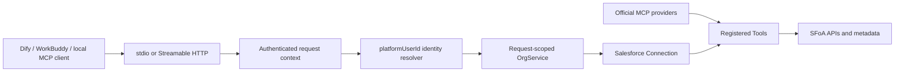
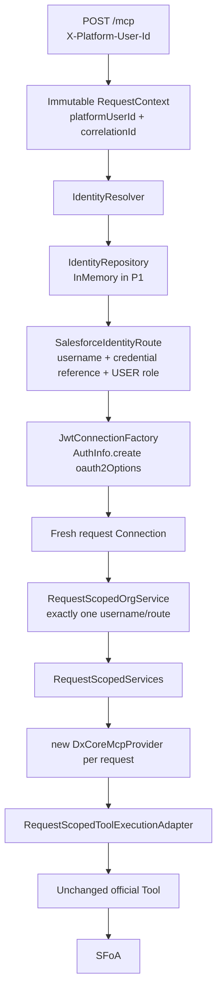
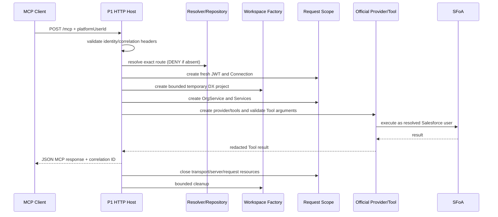

# SFoA Enterprise MCP Architecture

Status: P1 implemented and validated; `P1 = PASS`, awaiting maintainer review before P2

Upstream commit: `670234dbdca4d3fcdebd9d58b231e311fd34aeec`

## System boundary

SFoA Enterprise MCP selects the real Salesforce identity for an authenticated platform user and exposes deterministic Salesforce operations through MCP. Salesforce remains the authorization and business-rule authority. LLM clients perform analysis and summarization from Tool results.



## P1 Request Identity Flow

The implemented P1 composition lives in the SFoA-owned `packages/sfoa-identity-runtime` workspace. No official Salesforce TypeScript implementation is patched.



`platformUserId` is the only identity authority in P1. The HTTP Header is treated as trusted internal context for this POC; authenticating that claim belongs to P2. The resolver never falls back to a default/admin/first route. An official Tool's `usernameOrAlias` is only a consistency assertion: it may match the resolved username or that route's alias, but cannot select a Connection. A mismatch returns `MCP_IDENTITY_CONTEXT_MISMATCH` before JWT construction for the forged target or any Salesforce call for that target.

## P1 Request Lifecycle



| Resource | P1 lifetime and authority |
| --- | --- |
| `RequestContext` | One HTTP POST; frozen after validated Header parsing. `correlationId` is accepted only in the safe format or generated by `crypto.randomUUID()`. |
| Identity route | One POST; obtained only from `IdentityRepository.findByPlatformUserId`. It contains a credential profile reference, never private-key text. |
| JWT/AuthInfo/Connection | Fresh per request scope; no token cache, connection pool, CLI Auth Cache, or cross-request reuse. |
| `RequestScopedOrgService` / `RequestScopedServices` | One POST and exactly one allowed route. No global username set or mutable current-user singleton. |
| MCP server / transport / official Provider Tools | Fresh per POST; closed after response finish/close. P1 selects only official `get_username`, `run_soql_query`, and `retrieve_metadata`. |
| Request workspace | Unique bounded OS temporary directory with minimal DX project, package directory, and optional generated manifest; removed after response. |
| CWD guard | Host-wide read/write execution guard. Source-audited identity/SOQL Tools use the shared side; `retrieve_metadata` uses exclusive execution and restores CWD in `finally`. |

Request/connection contracts reserve `ConnectionRole = USER | DIAGNOSTIC`. P1 accepts only `USER` and rejects `DIAGNOSTIC` before authentication. P4 may introduce one fixed Diagnostic Integration User for metadata/Tooling system diagnosis; that role must never execute business SOQL, record queries, CREATE, or UPDATE.

## Upstream package dependency map

| Package | Role | Important runtime dependencies |
| --- | --- | --- |
| `@salesforce/mcp` | oclif stdio host, registry, Tool filtering, telemetry, process cache | MCP SDK, provider API, all bundled providers, `@salesforce/core`, SDR, source tracking, Apex/Agents SDKs |
| `@salesforce/mcp-provider-api` | Provider/Tool/Services contracts and Toolset enums | MCP SDK, `@salesforce/core`, Zod, semver |
| `@salesforce/mcp-provider-dx-core` | Core org, data, metadata, and test Tools | provider API, `@salesforce/core`, SDR, source tracking, Apex/Agents SDKs |
| `@salesforce/mcp-provider-code-analyzer` | Code Analyzer Tools | provider API and Code Analyzer engines |
| `@salesforce/mcp-provider-devops` | DevOps Center Tools | provider API, core, SDR; also uses local Git child processes |
| `@salesforce/mcp-provider-metadata-enrichment` | Local project metadata enrichment | provider API, dx-core, SDR, metadata-enrichment SDK |
| `@salesforce/mcp-provider-mobile-web` | Mobile/LWC guidance and analysis | provider API, ESLint/LWC analysis packages |
| `@salesforce/mcp-provider-scale-products` | Apex scale/performance analysis | provider API, Apex parser |
| `@salesforce/mcp-test-client` | Type-safe stdio test client | MCP SDK and Zod |
| `EXAMPLE-MCP-PROVIDER` | Minimal Provider template | provider API, MCP SDK, Zod |

The server source also imports published LWC and Aura provider packages that are not source workspaces in this checkout.

## Official stdio startup path

```text
packages/mcp/bin/run.js
  -> @oclif/core execute()
  -> McpServerCommand.run()
  -> parse --orgs / --toolsets / --tools
  -> Cache.allowedOrgs (singleton)
  -> new SfMcpServer()
  -> new Services()
  -> registerToolsets()
  -> MCP_PROVIDER_REGISTRY[].provideTools(services)
  -> server.registerTool(...)
  -> StdioServerTransport
  -> server.connect()
```

The official entry point provides stdio only. The installed MCP SDK already supports Streamable HTTP, so the transport gap is a host-composition gap, not a protocol or provider gap. The P0 public-Provider POC passed initialize, `tools/list`, and `tools/call` over stateless Streamable HTTP without an official Tool patch.

## Tool registry and filtering

- `MCP_PROVIDER_REGISTRY` is a static array of instantiated providers in `packages/mcp/src/registry.ts`.
- Providers asynchronously return `McpTool[]` through `provideTools(services)`.
- Provider major version compatibility is checked against `MCP_PROVIDER_API_VERSION`.
- Tools are grouped by `Toolset`; `core` is always enabled.
- Startup can select Toolsets, individual Tools, or dynamic Tool enablement.
- Non-GA Tools require `--allow-non-ga-tools`.
- Registered Tool objects and enabled state are stored in a process-wide singleton Cache.
- Prompts and resources exist in the Provider API but the main server does not consume them at this commit.
- The five audited core/data/metadata schemas expose Zod-derived JSON input schemas and some annotations, but no `outputSchema`; Tool results are primarily text rather than `structuredContent`. New SFoA Tools must use stronger structured output, bounds/pagination, and complete annotations without rewriting official Tool contracts during P0.

## Salesforce call implementation: SDK, not `sf` spawn

Core Salesforce runtime calls use Node SDKs. The audited dx-core path does not spawn the `sf` executable.

```text
--orgs values
  -> Cache.allowedOrgs
  -> AuthInfo.listAllAuthorizations()
  -> filter by explicit username/alias or DEFAULT_TARGET_* token
  -> findOrgByUsernameOrAlias()
  -> AuthInfo.create({ username: foundOrg.username })
  -> Connection.create({ authInfo })
  -> official Tool
```

The exact chain is normally **username -> AuthInfo -> Connection -> Tool**. `Org` is created only by Tools that need org-level behavior, producing **Connection -> Org.create({ connection })**. It is not a mandatory step for SOQL.

Examples:

- `run_soql_query`: `connection.query()` or `connection.tooling.query()`.
- `run_apex_test`: `new TestService(connection)` from `@salesforce/apex-node`.
- `retrieve_metadata`: `SfProject`, `Org`, `SourceTracking`, `ComponentSetBuilder`, and SDR retrieve APIs.
- `code-analysis`: Code Analyzer libraries/engines, not an `sf` subprocess.

Salesforce CLI is retained only as a development diagnostic and independent authentication/connectivity cross-check. It is **not** a production Runtime dependency, and the P0-Closure Harness deliberately creates fresh JWT `AuthInfo` directly instead of reading the CLI Auth Cache.

The production chain is fixed as:

```text
Node.js
  -> JWT/OAuth TokenProvider
  -> @salesforce/core
  -> AuthInfo / Connection
  -> official Salesforce Provider Tool
```

Production must not use `Node.js -> spawn sf command`.

## `--orgs` resolution semantics

- The flag is required at process startup and accepts explicit usernames/aliases plus `DEFAULT_TARGET_ORG`, `DEFAULT_TARGET_DEV_HUB`, and `ALLOW_ALL_ORGS`.
- Explicit values are written to the singleton Cache once.
- `AuthInfo.listAllAuthorizations()` is called on each connection/list request, then filtered against that allowlist.
- Default tokens are re-resolved on each Tool call through a cleared/recreated `ConfigAggregator`, using the current working directory.
- Alias resolution is converted to the stored username before `AuthInfo.create`.
- This is process-scoped authorization configuration. It does not bind an incoming request or `platformUserId` to one Salesforce identity.

## Provider classification for SFoA extensions

| Capability | Recommended form | Reason |
| --- | --- | --- |
| `sfoa-auth` | Shared service / adapter | Credential lookup and token/Connection construction are cross-cutting dependencies, not an agent-facing Tool. |
| `identity-routing` | HTTP middleware + request-context service | It authenticates the platform request and resolves `platformUserId` before Tool arguments are trusted. |
| `sobject-mutation` | New Provider plus shared allowlist service | CREATE/UPDATE are agent-visible operations; authorization policy and connection selection stay outside the Tool class. |
| `runtime-context` | Provider for deterministic read Tools, backed by a shared context service | Expose only context that an agent cannot obtain from existing generic Tools. |
| `diagnosis-context` | Composition/shared service first; Provider only for a proven missing deterministic operation | Prefer official SOQL, metadata, Apex test, and code-analysis Tools. |

## Metadata runtime

`retrieve_metadata` is not a stateless metadata-read endpoint. It:

1. Requires an absolute `directory`.
2. Changes the process working directory.
3. Resolves an `SfProject` and project config/source API version.
4. Creates `SourceTracking` even when a manifest/source path is supplied.
5. Builds a `ComponentSet` from source paths, a manifest, or remote tracking.
6. Retrieves and merges files into the default package directory.

Consequences:

- A valid DX project and writable filesystem are hard requirements.
- A manifest is optional, but a project is not.
- For orgs without source tracking, callers must specify source paths or a manifest.
- Remote production design must provide a temporary or controlled shared DX workspace.

P0-Closure first proved a disposable validation workspace (minimal `sfdx-project.json`, package directory, generated manifest, bounded cleanup). P1 promotes that pattern into a request-owned `RequestWorkspaceFactory`, while deliberately avoiding a Workspace Platform, worker pool, distributed lock, or shared workspace. Evaluate those only if P2/P4 metadata requirements and measured concurrency justify them.

At the audited commit, official `run_soql_query` and `retrieve_metadata` call `process.chdir(directory)` and do not restore the previous CWD. P1 therefore wraps every selected official Tool with a host-wide read/write `CwdExecutionGuard`: the two source-audited calls that do not consult CWD after their initial `chdir` can share execution, while metadata is exclusive and restores the captured CWD in `finally`. The live P1 Gate ran two concurrent official metadata requests; they serialized (`maxConcurrentExclusive = 1`), used distinct workspaces, restored CWD, and cleaned both roots.

## Concurrency and global state

The official stdio server is process-oriented:

- allowlisted orgs and Tool state are singleton Cache entries;
- `Services` is created once at startup and captured by Tool instances;
- many dx-core Tools call `process.chdir(directory)`;
- default-org resolution depends on the ambient working directory.

This is suitable for one local stdio client. It is unsafe to expose one unchanged instance concurrently to unrelated HTTP users.

P1 does not reuse that process graph. Each HTTP POST creates a fresh Connection, OrgService, Services instance, Provider, Tool set, MCP server, transport, and workspace. The only shared mutable coordination primitive is the CWD guard, which contains the unavoidable process-global side effect rather than storing identity. A 20-request real A/B run reported `Identity Mismatch = 0`, `Cross User Leak = 0`, and `Connection Reuse = 0`.

## Logging, telemetry, rate limiting, and testing

- The host uses `@salesforce/core` `Logger.childFromRoot('mcp-server')` for debug/warn events. Its visible startup message uses `console.error`, so stdio protocol stdout is not polluted by that message.
- Telemetry is injected through the Provider API `TelemetryService`; disabling it produces a no-op service. The official wrapper emits server-start/stop, Tool-called, and rate-limited events with Tool name, runtime, error flag, response character count, client/version, platform, and session/CLI identifiers. Telemetry calls are guarded so instrumentation cannot fail a Tool. P0 Inspector runs used `--no-telemetry`.
- The optional official rate limiter is one in-process token bucket around all registered Tool calls (default 60/minute, burst 10 when enabled). It is not identity-scoped and is therefore not a sufficient remote per-user quota or authorization mechanism.
- Provider packages use strict TypeScript plus Mocha/NYC or Vitest coverage. Live E2E suites are separate from root unit tests. `@salesforce/mcp-test-client` provides a typed stdio client; P0 adds an SDK Client Streamable HTTP integration test.
- P0 root build and full unit/integration tests pass. P0-Closure reproduces 47 existing code-analyzer lint errors as `UPSTREAM_LINT_BASELINE = KNOWN UPSTREAM DEBT`; `SFOA_CHANGED_CODE_LINT` passes for both SFoA workspaces. Unrelated official lint debt is not a Release blocker unless an SFoA change adds to it.

## Request-scoped routing options

| Criterion | Option A: official process host | Option B: request-scoped composition | Option C: isolated processes |
| --- | --- | --- | --- |
| Design | Reuse startup `--orgs`, singleton Cache, Services, and Tools | New Streamable HTTP host creates request context, Services, Provider Tools, and MCP server per POST | Gateway maps identity to supervised official/stdin-like workers |
| Identity isolation | Insufficient for unrelated remote users | Strong at route/Connection/Services boundary | Strong at process boundary |
| Upstream intrusion | None, but unsafe authorization semantics | None when public Provider packages are consumed | None |
| Performance | Low overhead | Low/moderate; fresh JWT/Connection in P1 | Higher memory/startup; pool lifecycle required |
| Complexity | Low | Moderate execution/workspace boundary | High supervision, RPC, crash, and eviction handling |
| `process.chdir` | Unsafe under shared concurrency | Shared/exclusive guard plus restore | Naturally isolated per process |
| P1 decision | Rejected for remote authorization | **Selected and validated** | Deferred for measured metadata pressure |

Implemented P1 path: **request-scoped Provider host** (ADR-0003 Option B), with a request-scoped `OrgService`, Services, provider Tool instances, server, transport, Connection, and workspace. Official Tool execution is wrapped by the CWD guard, and client directories are replaced by the request workspace. The real A/B and metadata Gates passed without official Tool patches. Per-user/request processes remain a measured-throughput fallback, not a P1 requirement.

Target flow:

```text
HTTP MCP request
  -> authenticated platformUserId
  -> IdentityResolver
  -> Salesforce username + credential reference
  -> JWT/OAuth TokenProvider
  -> request-scoped Connection
  -> official Provider Tool
```

P1 is implemented behind an `IdentityRepository` interface with `InMemoryIdentityRepository` for the two-user Gate. Persistence can replace that implementation without changing `IdentityResolver`, `RequestScopedOrgService`, or official Providers when durable routing/Admin configuration is actually required. Neither the P1 runtime nor production relies on local Salesforce CLI authentication state.

## Transport architecture

- Keep the official stdio entry unchanged for Codex, Cursor, and local development.
- Add an SFoA-owned Streamable HTTP host using the official SDK.
- Prefer stateless JSON-response mode initially: fresh MCP server/transport per request, no server session store.
- Bind the P0 POC to loopback and validate method/content type/origin/host as supported by the SDK.
- Add OAuth/client authentication and platform request identity in P2, after P1 identity routing is proven.

P0-Closure regression evidence: `@sfoa/streamable-http-poc` used MCP SDK 1.18.2 and local dx-core Provider 0.10.0, registered the five GA core/data/metadata Tools, and passed initialize/list/call, 405, Origin rejection, and cleanup assertions. The original packaged stdio host independently passed initialize/list/call against its declared dx-core 0.9.8 package. Exact resolved sets are authoritative in `PROVIDER_COMPATIBILITY.md`; production must not depend on accidental Yarn workspace resolution.

P1 evidence: `@sfoa/identity-runtime` explicitly pins MCP SDK 1.18.2, Provider API 0.6.0, dx-core 0.10.0, `@salesforce/core` 8.29.0, and Zod 3.25.76. It exposes stateless `POST /mcp` on loopback, rejects invalid method/content type/origin/host through the host/SDK boundary, and creates a new isolated scope for every POST. P2 must replace the trusted test Header with an authenticated gateway claim while preserving this exact downstream identity boundary.

## Future Admin UI location

Recommended P5 location: `apps/admin-web`.

This keeps a deployable application separate from publishable provider packages. At P5, add `apps/*` to Yarn workspaces through one deliberate root manifest change and record it in the Upstream divergence matrix. Do not create the workspace during P0.

Planned UI areas: dashboard, Salesforce account routing, object CREATE/UPDATE allowlists, MCP Tool governance, call audit, and system configuration.

## Data, cache, and security baseline

- P0, P0-Closure, and P1 use no database.
- P1 proves request-scoped identity routing with an in-memory repository. Persistence is introduced only when durable routing or Admin configuration actually needs it.
- No Redis without measured multi-node/session/cache requirements.
- Secrets remain outside Git; logs must redact tokens and private-key material.
- Tool annotations improve agent behavior but never replace authorization checks.
- DELETE is absent from the initial mutation design.
