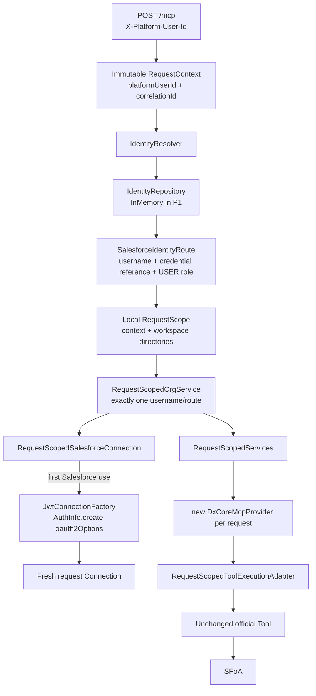
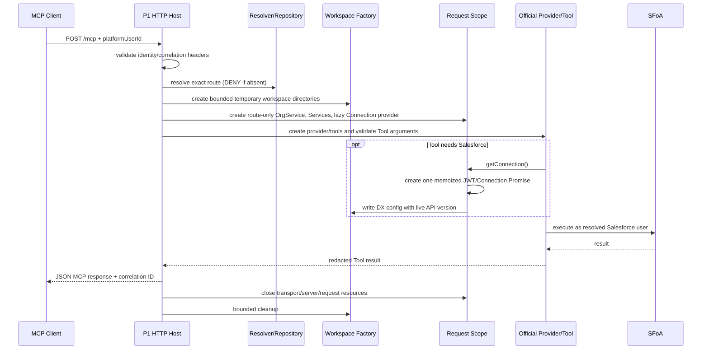
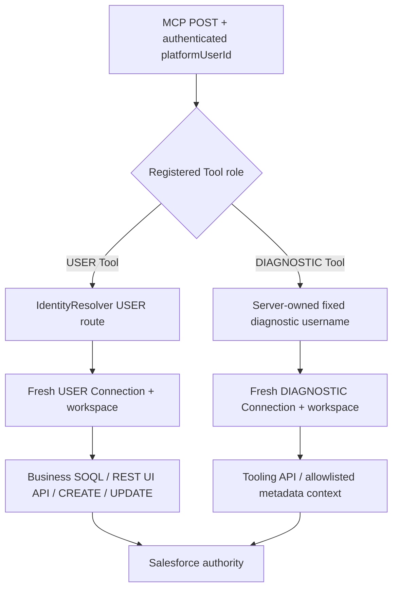
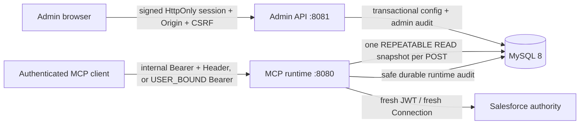
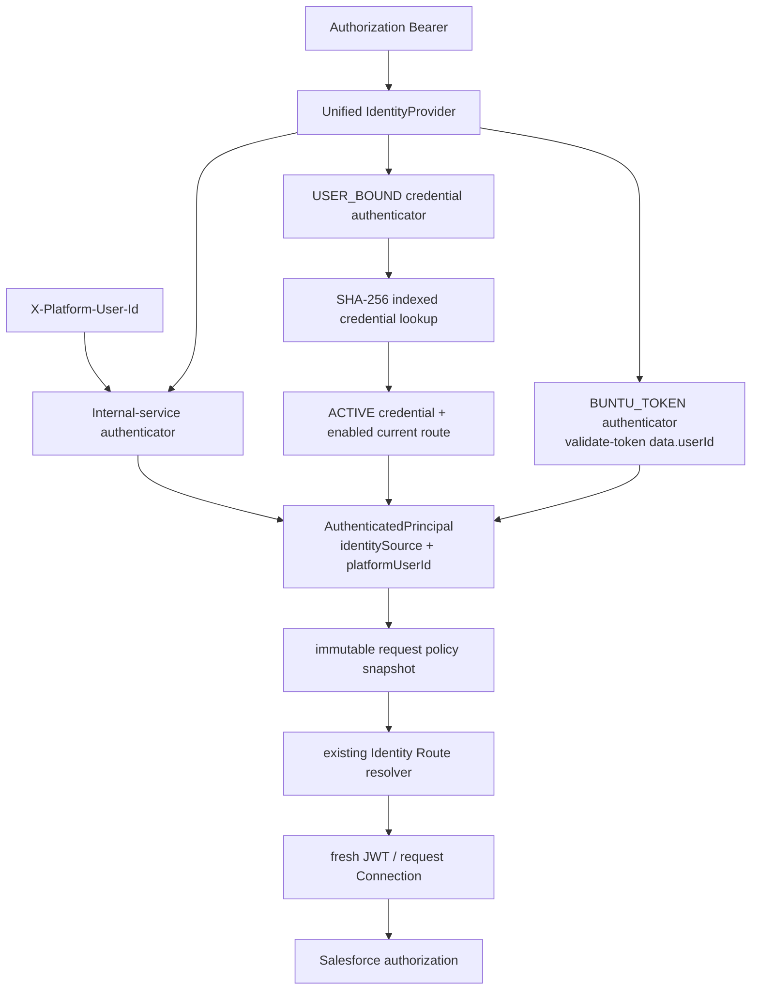
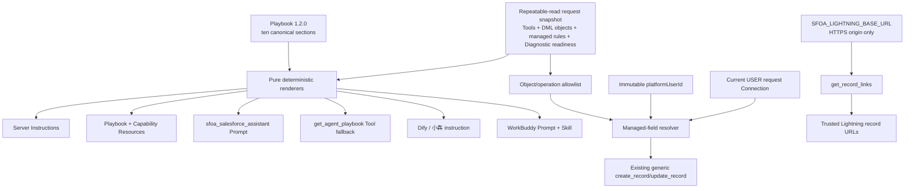
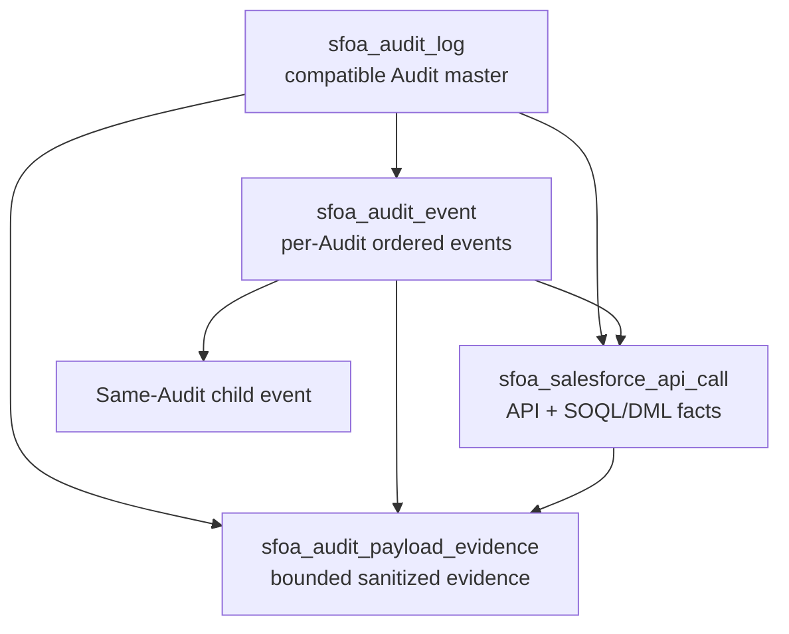

# SFoA Enterprise MCP Architecture

Status: P0–P5 final accepted; P6 implementation is present on `main` at `c849e577`; P7-01 through P7-06 are complete; P7-07 is implemented awaiting Maintainer final review; P7-08 and P7-09 are complete

Upstream commit: `670234dbdca4d3fcdebd9d58b231e311fd34aeec`

## System boundary

SFoA Enterprise MCP selects the real Salesforce identity for an authenticated platform user and exposes deterministic Salesforce operations through MCP. Salesforce remains the authorization and business-rule authority. LLM clients perform analysis and summarization from Tool results.

```mermaid
flowchart LR
  Client[Dify / WorkBuddy / local MCP client] --> Transport[stdio or Streamable HTTP]
  Playbook[Canonical Agent Playbook] --> Native[Instructions / Resources / Prompt / Tool fallback]
  Native --> Client
  Transport --> Context[Authenticated request context]
  Context --> Resolver[platformUserId identity resolver]
  Resolver --> Scope[Local RequestScope]
  Scope --> OrgService[Request-scoped OrgService]
  OrgService --> Lazy[Lazy Connection Provider]
  Lazy -->|first Salesforce use| Conn[Salesforce Connection]
  Registry[Official MCP providers] --> Tools[Registered Tools]
  Conn --> Tools
  Tools --> SFoA[SFoA APIs and metadata]
```



## P1 Request Identity Flow

The implemented P1 composition lives in the SFoA-owned `packages/sfoa-identity-runtime` workspace. No official Salesforce TypeScript implementation is patched.



`platformUserId` is the only identity authority in P1. The HTTP Header is treated as trusted internal context for this POC; authenticating that claim belongs to P2. The resolver never falls back to a default/admin/first route. An official Tool's `usernameOrAlias` is only a consistency assertion: it may match the resolved username or that route's alias, but cannot select a Connection. A mismatch returns `MCP_IDENTITY_CONTEXT_MISMATCH` before JWT construction for the forged target or any Salesforce call for that target.

## P1 Request Lifecycle



| Resource | P1 lifetime and authority |
| --- | --- |
| `RequestContext` | One HTTP POST; frozen after validated Header parsing. `correlationId` is accepted only in the safe format or generated by `crypto.randomUUID()`. |
| Identity route | One POST; obtained only from `IdentityRepository.findByPlatformUserId`. It contains a credential profile reference, never private-key text. |
| JWT/AuthInfo/Connection | Lazy on first Salesforce-dependent use and Promise-memoized within one request scope; no token cache, connection pool, CLI Auth Cache, or cross-request/role reuse. |
| `RequestScopedOrgService` / `RequestScopedServices` | One POST and exactly one allowed route. Route-only methods do not obtain a Connection. No global username set or mutable current-user singleton. |
| MCP server / transport / official Provider Tools | Fresh per POST; closed after response finish/close. P1 selects only official `get_username`, `run_soql_query`, and `retrieve_metadata`. |
| Request workspace | Unique bounded OS temporary directory. Directories exist at scope creation; the DX project/optional manifest receive the live API version only when the lazy Connection initializes; removed after response. |
| CWD guard | Host-wide read/write execution guard. Source-audited identity/SOQL Tools use the shared side; `retrieve_metadata` uses exclusive execution and restores CWD in `finally`. |

Request/connection contracts use `ConnectionRole = USER | DIAGNOSTIC`. P1 established USER routing. P4 adds a separate server-created DIAGNOSTIC route only when `SFOA_DIAGNOSTIC_USERNAME` is configured; clients cannot construct or select it. USER business reads/UI context/CREATE/UPDATE and DIAGNOSTIC Tooling/metadata reads are mutually blocked at the facade boundary.

## Upstream package dependency map

| Package | Role | Important runtime dependencies |
| --- | --- | --- |
| `@salesforce/mcp` | oclif stdio host, registry, Tool filtering, telemetry, process cache | MCP SDK, provider API, all bundled providers, `@salesforce/core`, SDR, source tracking, Apex/Agents SDKs |
| `@salesforce/mcp-provider-api` | Provider/Tool/Services contracts and Toolset enums | MCP SDK, `@salesforce/core`, Zod, semver |
| `@salesforce/mcp-provider-dx-core` | Core org, data, metadata, and test Tools | provider API, `@salesforce/core`, SDR, source tracking, Apex/Agents SDKs |
| `@salesforce/mcp-provider-code-analyzer` | Code Analyzer Tools | provider API and Code Analyzer engines |
| `@salesforce/mcp-provider-devops` | DevOps Center Tools | provider API, core, SDR; also uses local Git child processes |
| `@salesforce/mcp-provider-metadata-enrichment` | Local project metadata enrichment | provider API, dx-core, SDR, metadata-enrichment SDK |
| `@salesforce/mcp-provider-mobile-web` | Mobile/LWC guidance and analysis | provider API, ESLint/LWC analysis packages |
| `@salesforce/mcp-provider-scale-products` | Apex scale/performance analysis | provider API, Apex parser |
| `@salesforce/mcp-test-client` | Type-safe stdio test client | MCP SDK and Zod |
| `EXAMPLE-MCP-PROVIDER` | Minimal Provider template | provider API, MCP SDK, Zod |
| `@sfoa/agent-playbook` | Pure versioned Agent operating contract and renderers | no production dependencies; browser and Node compatible |

The server source also imports published LWC and Aura provider packages that are not source workspaces in this checkout.

## Official stdio startup path

```text
packages/mcp/bin/run.js
  -> @oclif/core execute()
  -> McpServerCommand.run()
  -> parse --orgs / --toolsets / --tools
  -> Cache.allowedOrgs (singleton)
  -> new SfMcpServer()
  -> new Services()
  -> registerToolsets()
  -> MCP_PROVIDER_REGISTRY[].provideTools(services)
  -> server.registerTool(...)
  -> StdioServerTransport
  -> server.connect()
```

The official entry point provides stdio only. The installed MCP SDK already supports Streamable HTTP, so the transport gap is a host-composition gap, not a protocol or provider gap. The P0 public-Provider POC passed initialize, `tools/list`, and `tools/call` over stateless Streamable HTTP without an official Tool patch.

## Tool registry and filtering

- `MCP_PROVIDER_REGISTRY` is a static array of instantiated providers in `packages/mcp/src/registry.ts`.
- Providers asynchronously return `McpTool[]` through `provideTools(services)`.
- Provider major version compatibility is checked against `MCP_PROVIDER_API_VERSION`.
- Tools are grouped by `Toolset`; `core` is always enabled.
- Startup can select Toolsets, individual Tools, or dynamic Tool enablement.
- Non-GA Tools require `--allow-non-ga-tools`.
- Registered Tool objects and enabled state are stored in a process-wide singleton Cache.
- Prompts and resources exist in the Provider API but the main server does not consume them at this commit.
- The five audited core/data/metadata schemas expose Zod-derived JSON input schemas and some annotations, but no `outputSchema`; Tool results are primarily text rather than `structuredContent`. New SFoA Tools must use stronger structured output, bounds/pagination, and complete annotations without rewriting official Tool contracts during P0.

## Salesforce call implementation: SDK, not `sf` spawn

Core Salesforce runtime calls use Node SDKs. The audited dx-core path does not spawn the `sf` executable.

```text
--orgs values
  -> Cache.allowedOrgs
  -> AuthInfo.listAllAuthorizations()
  -> filter by explicit username/alias or DEFAULT_TARGET_* token
  -> findOrgByUsernameOrAlias()
  -> AuthInfo.create({ username: foundOrg.username })
  -> Connection.create({ authInfo })
  -> official Tool
```

The exact chain is normally **username -> AuthInfo -> Connection -> Tool**. `Org` is created only by Tools that need org-level behavior, producing **Connection -> Org.create({ connection })**. It is not a mandatory step for SOQL.

Examples:

- `run_soql_query`: `connection.query()` or `connection.tooling.query()`.
- `run_apex_test`: `new TestService(connection)` from `@salesforce/apex-node`.
- `retrieve_metadata`: `SfProject`, `Org`, `SourceTracking`, `ComponentSetBuilder`, and SDR retrieve APIs.
- `code-analysis`: Code Analyzer libraries/engines, not an `sf` subprocess.

Salesforce CLI is retained only as a development diagnostic and independent authentication/connectivity cross-check. It is **not** a production Runtime dependency, and the P0-Closure Harness deliberately creates fresh JWT `AuthInfo` directly instead of reading the CLI Auth Cache.

The production chain is fixed as:

```text
Node.js
  -> JWT/OAuth TokenProvider
  -> @salesforce/core
  -> AuthInfo / Connection
  -> official Salesforce Provider Tool
```

Production must not use `Node.js -> spawn sf command`.

## `--orgs` resolution semantics

- The flag is required at process startup and accepts explicit usernames/aliases plus `DEFAULT_TARGET_ORG`, `DEFAULT_TARGET_DEV_HUB`, and `ALLOW_ALL_ORGS`.
- Explicit values are written to the singleton Cache once.
- `AuthInfo.listAllAuthorizations()` is called on each connection/list request, then filtered against that allowlist.
- Default tokens are re-resolved on each Tool call through a cleared/recreated `ConfigAggregator`, using the current working directory.
- Alias resolution is converted to the stored username before `AuthInfo.create`.
- This is process-scoped authorization configuration. It does not bind an incoming request or `platformUserId` to one Salesforce identity.

## Provider classification for SFoA extensions

| Capability | Recommended form | Reason |
| --- | --- | --- |
| `sfoa-auth` | Shared service / adapter | Credential lookup and token/Connection construction are cross-cutting dependencies, not an agent-facing Tool. |
| `identity-routing` | HTTP middleware + request-context service | It authenticates the platform request and resolves `platformUserId` before Tool arguments are trusted. |
| `sobject-mutation` | New Provider plus shared allowlist service | CREATE/UPDATE are agent-visible operations; authorization policy and connection selection stay outside the Tool class. |
| `runtime-context` | Provider for deterministic read Tools, backed by a shared context service | Expose only context that an agent cannot obtain from existing generic Tools. |
| `diagnosis-context` | Composition/shared service first; Provider only for a proven missing deterministic operation | Prefer official SOQL, metadata, Apex test, and code-analysis Tools. |

## Metadata runtime

`retrieve_metadata` is not a stateless metadata-read endpoint. It:

1. Requires an absolute `directory`.
2. Changes the process working directory.
3. Resolves an `SfProject` and project config/source API version.
4. Creates `SourceTracking` even when a manifest/source path is supplied.
5. Builds a `ComponentSet` from source paths, a manifest, or remote tracking.
6. Retrieves and merges files into the default package directory.

Consequences:

- A valid DX project and writable filesystem are hard requirements.
- A manifest is optional, but a project is not.
- For orgs without source tracking, callers must specify source paths or a manifest.
- Remote production design must provide a temporary or controlled shared DX workspace.

P0-Closure first proved a disposable validation workspace (minimal `sfdx-project.json`, package directory, generated manifest, bounded cleanup). P1 promotes that pattern into a request-owned `RequestWorkspaceFactory`, while deliberately avoiding a Workspace Platform, worker pool, distributed lock, or shared workspace. Evaluate those only if P2/P4 metadata requirements and measured concurrency justify them.

At the audited commit, official `run_soql_query` and `retrieve_metadata` call `process.chdir(directory)` and do not restore the previous CWD. P1 therefore wraps every selected official Tool with a host-wide read/write `CwdExecutionGuard`: the two source-audited calls that do not consult CWD after their initial `chdir` can share execution, while metadata is exclusive and restores the captured CWD in `finally`. The live P1 Gate ran two concurrent official metadata requests; they serialized (`maxConcurrentExclusive = 1`), used distinct workspaces, restored CWD, and cleaned both roots.

## Concurrency and global state

The official stdio server is process-oriented:

- allowlisted orgs and Tool state are singleton Cache entries;
- `Services` is created once at startup and captured by Tool instances;
- many dx-core Tools call `process.chdir(directory)`;
- default-org resolution depends on the ambient working directory.

This is suitable for one local stdio client. It is unsafe to expose one unchanged instance concurrently to unrelated HTTP users.

P1 does not reuse that process graph. Each HTTP POST creates a fresh Connection, OrgService, Services instance, Provider, Tool set, MCP server, transport, and workspace. The only shared mutable coordination primitive is the CWD guard, which contains the unavoidable process-global side effect rather than storing identity. A 20-request real A/B run reported `Identity Mismatch = 0`, `Cross User Leak = 0`, and `Connection Reuse = 0`.

## Logging, telemetry, rate limiting, and testing

- The host uses `@salesforce/core` `Logger.childFromRoot('mcp-server')` for debug/warn events. Its visible startup message uses `console.error`, so stdio protocol stdout is not polluted by that message.
- Telemetry is injected through the Provider API `TelemetryService`; disabling it produces a no-op service. The official wrapper emits server-start/stop, Tool-called, and rate-limited events with Tool name, runtime, error flag, response character count, client/version, platform, and session/CLI identifiers. Telemetry calls are guarded so instrumentation cannot fail a Tool. P0 Inspector runs used `--no-telemetry`.
- The optional official rate limiter is one in-process token bucket around all registered Tool calls (default 60/minute, burst 10 when enabled). It is not identity-scoped and is therefore not a sufficient remote per-user quota or authorization mechanism.
- Provider packages use strict TypeScript plus Mocha/NYC or Vitest coverage. Live E2E suites are separate from root unit tests. `@salesforce/mcp-test-client` provides a typed stdio client; P0 adds an SDK Client Streamable HTTP integration test.
- P0 root build and full unit/integration tests pass. P0-Closure reproduces 47 existing code-analyzer lint errors as `UPSTREAM_LINT_BASELINE = KNOWN UPSTREAM DEBT`; `SFOA_CHANGED_CODE_LINT` passes for both SFoA workspaces. Unrelated official lint debt is not a Release blocker unless an SFoA change adds to it.

## Request-scoped routing options

| Criterion | Option A: official process host | Option B: request-scoped composition | Option C: isolated processes |
| --- | --- | --- | --- |
| Design | Reuse startup `--orgs`, singleton Cache, Services, and Tools | New Streamable HTTP host creates request context, Services, Provider Tools, and MCP server per POST | Gateway maps identity to supervised official/stdin-like workers |
| Identity isolation | Insufficient for unrelated remote users | Strong at route/Connection/Services boundary | Strong at process boundary |
| Upstream intrusion | None, but unsafe authorization semantics | None when public Provider packages are consumed | None |
| Performance | Low overhead | Low/moderate; fresh JWT/Connection in P1 | Higher memory/startup; pool lifecycle required |
| Complexity | Low | Moderate execution/workspace boundary | High supervision, RPC, crash, and eviction handling |
| `process.chdir` | Unsafe under shared concurrency | Shared/exclusive guard plus restore | Naturally isolated per process |
| P1 decision | Rejected for remote authorization | **Selected and validated** | Deferred for measured metadata pressure |

Implemented P1 path: **request-scoped Provider host** (ADR-0003 Option B), with a request-scoped `OrgService`, Services, provider Tool instances, server, transport, Connection, and workspace. Official Tool execution is wrapped by the CWD guard, and client directories are replaced by the request workspace. The real A/B and metadata Gates passed without official Tool patches. Per-user/request processes remain a measured-throughput fallback, not a P1 requirement.

Target flow:

```text
HTTP MCP request
  -> authenticated platformUserId
  -> IdentityResolver
  -> Salesforce username + credential reference
  -> JWT/OAuth TokenProvider
  -> request-scoped Connection
  -> official Provider Tool
```

P1 is implemented behind an `IdentityRepository` interface with `InMemoryIdentityRepository` for the two-user Gate. Persistence can replace that implementation without changing `IdentityResolver`, `RequestScopedOrgService`, or official Providers when durable routing/Admin configuration is actually required. Neither the P1 runtime nor production relies on local Salesforce CLI authentication state.

## Transport architecture

- Keep the official stdio entry unchanged for Codex, Cursor, and local development.
- Add an SFoA-owned Streamable HTTP host using the official SDK.
- Prefer stateless JSON-response mode initially: fresh MCP server/transport per request, no server session store.
- Bind the P0 POC to loopback and validate method/content type/origin/host as supported by the SDK.
- Add OAuth/client authentication and platform request identity in P2, after P1 identity routing is proven.

P0-Closure regression evidence: `@sfoa/streamable-http-poc` used MCP SDK 1.18.2 and local dx-core Provider 0.10.0, registered the five GA core/data/metadata Tools, and passed initialize/list/call, 405, Origin rejection, and cleanup assertions. The original packaged stdio host independently passed initialize/list/call against its declared dx-core 0.9.8 package. Exact resolved sets are authoritative in `PROVIDER_COMPATIBILITY.md`; production must not depend on accidental Yarn workspace resolution.

P1 evidence: `@sfoa/identity-runtime` explicitly pins MCP SDK 1.18.2, Provider API 0.6.0, dx-core 0.10.0, `@salesforce/core` 8.29.0, and Zod 3.25.76. It exposes stateless `POST /mcp` on loopback, rejects invalid method/content type/origin/host through the host/SDK boundary, and creates a new isolated scope for every POST. P2 preserves this downstream identity boundary in a separate production-oriented Host.

## P2 Remote Request Lifecycle

```text
Dify / WorkBuddy / Generic MCP Client
  -> exact Host/Origin check
  -> Internal Bearer client authentication
  -> configured platform-user Header parsing
  -> IdentityResolver (no fallback)
  -> bounded JSON body
  -> fresh JWT + request-scoped Connection
  -> disposable RequestWorkspace
  -> fresh official Provider Tools
  -> registration-time ToolGovernancePolicy
  -> RemoteToolFacade injects username/directory
  -> unchanged official Tool.exec()
  -> JSON response finish/close
  -> transport + McpServer + workspace cleanup
```

The formal P2 package is `packages/sfoa-mcp-server`. `packages/sfoa-identity-runtime` remains the identity/request-scope foundation; its P1 loopback validation Host is not the production Host.

The P2 Host waits for the HTTP response `finish`/`close` event, not merely `StreamableHTTPServerTransport.handleRequest()` resolution, before cleanup. SDK 1.18.2 can return from `handleRequest()` while an asynchronous Tool handler is still producing its response; response-lifecycle tracking prevents premature resource disposal under concurrent calls.

## Client Authentication Boundary

P2 uses a minimal controlled-client boundary:

```text
Authorization Bearer
  -> timing-safe digest comparison
  -> authenticated client identifier
  -> X-Platform-User-Id accepted
  -> P1 IdentityResolver
```

Missing/invalid Bearer requests fail with stable 401 codes. Missing/unknown platform identities fail before Salesforce JWT creation. `MCP_AUTH_MODE=disabled` is accepted only when the configured bind host is `127.0.0.1`, `localhost`, or `::1`; non-loopback disabled-auth configuration fails startup.

The shared internal Bearer authenticates a controlled MCP client, not a human. Until a trusted SSO/gateway claim mapper exists, that client is responsible for setting the correct platform Header. The Host never accepts identity from Tool arguments, query parameters, or JSON body fields.

## Tool Governance Boundary

Official Provider availability and SFoA Agent visibility are distinct:

```text
real public DxCoreMcpProvider
  -> actual Provider/package/API + Tool contracts
  -> executable inventory drift comparison
  -> explicit READ / METADATA_READ / MUTATION / ADMIN / LOCAL_DEV / UNKNOWN record
  -> P2 classification allow rule
  -> provider compatibility/presence check
  -> MCP_ENABLED_TOOLS intersection
  -> register permitted Tools only
  -> tools/list
```

Default enabled Tools are `get_username` and `run_soql_query`. `retrieve_metadata` is composition-compatible but disabled by default because it requires developer manifest/source context and filesystem/CWD handling. P2 rejects mutation, admin, local-development, incompatible, and unknown configuration during startup; disabled Tools are not visible.

`official-tool-catalog.ts` is the sole executable safety source. `OFFICIAL_PROVIDER_INVENTORY.md` is informational only. Classification is explicit and is never inferred from a Tool name, description, annotation, or Provider presence.

The P2 Closure inspector constructs the real public dx-core Provider and compares Provider/package/API versions, Tool names, ReleaseState, input field names/requiredness, and output-schema capability with the audited catalog. Any drift makes `validate:upstream` return `UPSTREAM_REVIEW_REQUIRED`. An unrelated added Tool remains invisible under registration-time default deny and need not stop production; drift affecting an enabled remote Tool fails startup with `MCP_UPSTREAM_TOOL_CONTRACT_DRIFT`.

## Remote Tool Schema Boundary

`RemoteToolFacade` first requires the official `McpTool.getConfig()` surface and ReleaseState to exactly match the audited executable contract. It then constructs the remote Zod shape from an explicit Agent-field whitelist and injects authoritative technical arguments before delegating to the P1 adapter:

| Tool | Agent input | Host injection |
| --- | --- | --- |
| `get_username` | `defaultTargetOrg`, `defaultDevHub` | request workspace `directory` |
| `run_soql_query` | `query`, `useToolingApi` | route `usernameOrAlias`, workspace `directory` |
| `retrieve_metadata` | `ignoreConflicts`, `sourceDir`, `manifest` | route `usernameOrAlias`, workspace `directory` |

An upstream Tool field is therefore denied until maintainer review; it is never exposed merely because it is not host-owned. Missing/renamed host or Agent fields and ReleaseState changes also fail closed. The core remains unchanged official `Tool.exec()`. No SOQL, metadata execution, official error parsing, or Salesforce API behavior is reimplemented. ADR-0007 supersedes the open-ended projection decision in ADR-0006.

Host-owned `usernameOrAlias`/`directory` are input-authority and workspace fields only — they are not a proxy for Connection need. Whether a remote Tool acquires the request-scoped Salesforce Connection is the explicit `requiresSalesforceConnection` boolean on its `RemoteToolContract`: `get_username` = `false`, `run_soql_query`/`retrieve_metadata` = `true` (lazily, exactly one, at execution).

Final P2 Closure path:

```text
Official Provider
  -> Actual Tool Contract
  -> Drift Guard
  -> Explicit SFoA Governance
  -> RemoteToolFacade
  -> unchanged Tool.exec()
```

## Reverse Proxy Boundary

P2 accepts direct HTTP but defines a future TLS proxy contract in `P2_REVERSE_PROXY.md`. The proxy preserves `Authorization`, the configured platform Header, correlation ID, and intended Host; it overwrites proxy-owned forwarding headers. Node exact-matches Host/Origin before Salesforce auth.

P2 does not authorize from `X-Forwarded-For` or `X-Forwarded-Proto`. Those values become trustworthy only when a known proxy overwrites them and direct Node-port access is blocked. A future public-client gateway must derive and overwrite platform identity from authenticated claims rather than forwarding an arbitrary inbound value.

## Request Bounds, Timeout, and Cleanup

- `MCP_MAX_BODY_BYTES` bounds streamed request bytes and returns HTTP 413 before JWT.
- `MCP_REQUEST_TIMEOUT_MS` bounds the complete POST wait. It returns HTTP 504 `MCP_REQUEST_TIMEOUT` before mutation dispatch and `MCP_DML_OUTCOME_UNKNOWN` after request-local CREATE/UPDATE dispatch awareness is marked.
- `MCP_TOOL_TIMEOUT_MS` bounds the Tool wait. Official read Tool facades retain Tool-level `MCP_TOOL_TIMEOUT`; the P3 DML facade converts its timeout to structured `MCP_DML_OUTCOME_UNKNOWN` because server-side mutation cancellation is not guaranteed.
- Defaults are request `180000` ms and Tool `120000` ms. Startup fails closed when request timeout is less than or equal to Tool timeout. The ordering is an operational guard, not the mutation safety proof.
- Response finish/close, timeout, client disconnect, and graceful shutdown converge on idempotent transport/server/workspace cleanup.
- SIGINT/SIGTERM stop new acceptance, drain active requests to the configured bound, close idle/all connections as needed, and set an exit code without immediate `process.exit()`.

The Salesforce SDK path does not expose a reliable end-to-end abort of an operation already accepted server-side. P2 stops waiting and cleans local resources; it does not claim remote Salesforce cancellation.

## P3 Generic DML Boundary

P3 implements the accepted extension seam without broadening P2's official Tool classification policy:

```text
Agent
  -> authenticated Streamable HTTP request
  -> X-Platform-User-Id / P1 IdentityResolver
  -> fresh request-scoped Salesforce Connection
  -> exact P3 Tool-name governance
  -> strict Object x CREATE/UPDATE policy
  -> @salesforce/core Connection.sobject()
  -> single-record create() or update()
  -> Salesforce native CRUD/FLS/sharing/validation/Flow/Trigger
```

`@sfoa/mcp-provider-sfoa-dml` is a new SFoA-owned Provider composed through the public Provider API. It exposes exactly `create_record` and `update_record`. The two classes call only the pinned public single-record `sobject().create(fields)` and `sobject().update({ Id, ...fields })` methods on the already-authenticated request Connection. They do not construct a Connection, read CLI Auth Cache, implement OAuth, invoke raw REST, query after mutation, or copy an official Tool.

The Agent schemas contain only:

| Tool | Agent input | Output |
| --- | --- | --- |
| `create_record` | `objectApiName`, non-empty scalar `fields` | `success`, `recordId` |
| `update_record` | `objectApiName`, separate `recordId`, non-empty scalar `fields` | `success`, `recordId` |

Identity, username/alias, instance URL, token, directory, operation, REST path, and API-version controls are absent. `fields.Id`, nested objects/arrays, and relationship paths are rejected. There is no post-mutation SOQL. Unknown Tool arguments cannot alter request authority; the MCP SDK removes non-schema arguments before the strict Tool parser, while the request-scoped `OrgService` still exposes exactly one route.

`MCP_DML_ALLOWLIST_JSON` is parsed once at startup into an immutable `DmlAllowlistPolicy`. Its array form preserves duplicate detection:

```json
[
  { "objectApiName": "Lead", "operations": ["CREATE", "UPDATE"] },
  { "objectApiName": "Account", "operations": ["UPDATE"] }
]
```

Missing, blank, or `[]` means deny all. Invalid JSON, unknown fields/operations, DELETE, duplicate objects, and duplicate operations fail startup. Unknown objects and unconfigured Object-by-Operation pairs fail before Connection retrieval or DML execution.

Tool visibility is a separate dual gate: the exact `create_record`/`update_record` name must appear in `MCP_ENABLED_TOOLS`, and the policy must contain at least one object for its operation. P2's general `MUTATION` classification remains forbidden, so `deploy_metadata`, `assign_permission_set`, and every other official mutation/admin Tool stay unavailable.

P3 adds stable outer errors while retaining bounded safe Salesforce error code/message/field details. It does not reinterpret Salesforce validation or build a field permission engine. DELETE, UNDELETE, UPSERT, MERGE, Bulk DML, arbitrary REST, metadata mutation, and Apex mutation substitutes are absent from production code and Tool schemas.

### P3-Closure HOTFIX01 mutation outcome semantics

The pinned `@salesforce/core@8.29.0` resolves `@jsforce/jsforce-node@3.10.13`. For single-record REST DML, JSforce returns a `SaveResult` on success and wraps an HTTP error response in an error whose `data` retains the Salesforce REST error body. SFoA therefore classifies only structural evidence; it never guesses from an exception class, HTTP-status absence, error name, or message substring.

```text
SaveResult.success === false
or reliable errorCode + message + fields evidence
  -> MCP_SALESFORCE_DML_FAILED
  -> Salesforce explicitly rejected the mutation

DML Tool timeout
or mutation Promise rejection without reliable rejection evidence
  -> MCP_DML_OUTCOME_UNKNOWN
  -> commit state cannot be determined
  -> do not automatically retry
  -> verify with an independent read when possible
```

The timeout races only the Host wait; it does not cancel or replay the underlying SDK Promise. Deterministic tests let CREATE/UPDATE resolve after the timeout and prove exactly one invocation. The client-visible result keeps the existing compact shape (`success`, `errorCode`, `message`); correlation ID remains a log-correlation value rather than an idempotency key or Salesforce commit-status token.

The request log continues to record `correlationId`, `toolName`, `platformUserId`, and `salesforceUsername` with `MCP_DML_OUTCOME_UNKNOWN`. Causes, stacks, JWTs, tokens, private keys, client secrets, and Connection objects are not returned.

### P3-Closure HOTFIX02 request-level mutation outcome semantics

Every HTTP POST owns one minimal `MutationRequestState`. The DML Provider receives only a small `MutationExecutionObserver`; it has no dependency on the HTTP server. `DmlExecutor` marks the observer immediately before invoking the public SDK `create()` or `update()` method, after schema, Object-by-Operation, and request-identity checks have succeeded.

```text
HTTP MCP POST
  -> request-local MutationRequestState = NOT_STARTED
  -> authentication / identity / Provider preparation
  -> DML schema and Object x Operation governance
  -> request-scoped Connection and SObject handle
  -> observer.onMutationStarted(CREATE | UPDATE)
  -> Connection.sobject().create() / update()
```

The state deliberately contains only the first started operation; there is no global state, SETTLED ledger, replay key, or persistence layer. The outer timeout race classifies its legal JSON-RPC error from that request-owned state:

```text
NOT_STARTED + request timeout
  -> HTTP 504 / MCP_REQUEST_TIMEOUT

STARTED + request timeout
  -> HTTP 504 / JSON-RPC -32001
  -> error.data.errorCode = MCP_DML_OUTCOME_UNKNOWN
  -> error.data.retryable = false
```

The UNKNOWN message says that Salesforce commit state cannot be determined, automatic retry is forbidden, server-side cancellation is not guaranteed, and an independent read must precede another mutation. Safe logs include correlation ID, Tool, operation, platform user, Salesforce username, duration, `outcome=UNKNOWN`, `mutationStarted=true`, and `terminationLayer=TOOL|REQUEST|TRANSPORT`. A disconnected client cannot receive a response, but post-start socket/response termination is logged as UNKNOWN and the Host performs no replay or retry.

Pinned `@jsforce/jsforce-node@3.10.13` source keeps default retry methods at `GET`, `PUT`, `HEAD`, `OPTIONS`, and `DELETE`. Single-record CREATE `POST` and UPDATE `PATCH` are absent. SFoA does not patch or fork this transport.

The independent live validator may call SDK `destroy(recordId)` only for IDs returned by that validator run. That cleanup method is not imported by the Provider, registered as a Tool, or used for query-based deletion.

## P4 Diagnosis and Runtime Context Boundary

P4 splits one authenticated MCP request into one of two fixed execution roles:



The client cannot submit a role, username, credential, token, instance URL, directory, manifest, arbitrary URL, or API-route switch. A single enabled diagnostic Tool name selects only the fixed diagnostic scope. Non-Tool calls and JSON-RPC batches remain USER-scoped; wrong-role facades reject execution before invoking an official Tool or SDK mutation.

`SFOA_DIAGNOSTIC_USERNAME` is optional while diagnostic Tools are disabled. Enabling `run_diagnostic_tooling_query` or `get_metadata_component_context` without it fails startup with `MCP_DIAGNOSTIC_CONFIGURATION_INVALID`. P4 reuses the existing Connected App/JWT configuration and creates a new Connection per request. It adds no second OAuth scheme, global admin Connection, token cache, Connection pool, database, or Redis.

### P4 Context Provider

`@sfoa/mcp-provider-sfoa-context` is an SFoA-owned public-Provider-API extension with exactly three GA read-only Tools:

| Tool | Role | Execution surface |
| --- | --- | --- |
| `get_record_action_context` | USER | Direct verified REST UI API through the request Connection |
| `run_diagnostic_tooling_query` | DIAGNOSTIC | Unchanged official `run_soql_query` with server-forced `useToolingApi=true` |
| `get_metadata_component_context` | DIAGNOSTIC | Unchanged official `retrieve_metadata` plus same-request bounded file reading |

The actual dx-core audit found 13 Tools and nine GA Tools. `run_soql_query` and `retrieve_metadata` are reused as internal primitives, not copied. The actual Code Analyzer Provider returned six Tools, but its Agent-selected absolute local targets, durable project requirement, and global-temp result file are incompatible with the request-owned remote workspace. Code Analyzer remains unavailable; no replacement analyzer or durable filesystem service was added.

### Record action facts

The live SFoA API 67.0 audit verified REST UI API Object Info, Create/Edit Layout, Create Defaults, and record-type Picklist Values for both USER routes. GraphQL `recordLayouts` also worked, but is not required because REST covers the complete P4 fact set through one public surface.

CREATE resolves the USER default record type unless an explicit currently available type is supplied. UPDATE obtains the record's real record type and rejects an explicit mismatch. Output keeps these facts separate:

- API required versus Page Layout required;
- field createable/updateable versus layout create/update editability;
- Salesforce-supplied defaults versus absent values;
- layout membership, section, and order;
- record-type picklist values/defaults and dependent-controller indexes;
- field label/type/reference metadata;
- coverage sources, call count, duration, source-response bytes, warnings, and truncation.

Field output is capped at 200, with API-required fields selected first. Picklists are capped at 100 values per field and 500 globally. Defaults, reference targets, dependency indexes, total response size, metadata file count, per-file bytes, total bytes, and diagnostic records are separately bounded. Truncation is explicit; a required-field set that cannot fit safely fails rather than silently dropping required facts.

This is an effective Page Layout/UI API action context, not a complete Dynamic Forms or Lightning component-visibility engine. `dynamicFormsEvaluated=false` and `completeLightningPageEvaluated=false` are explicit. Salesforce still evaluates CRUD, FLS, sharing, validation, Flow, Trigger, and final DML.

### Diagnostic metadata workspace

The metadata wrapper accepts only one allowlisted type and exact Metadata API full name. It XML-escapes a server-generated manifest, invokes official `retrieve_metadata` under the existing exclusive CWD guard, and reads only `force-app/main/default` beneath the request root. Symlinks and path escape do not become readable files. Only UTF-8 `.xml`, `.cls`, and `.trigger` content is returned, with known credential patterns redacted and omission summaries bounded.

The initial allowlist is `CustomObject`, `CustomField`, `ValidationRule`, `Flow`, `ApexClass`, `ApexTrigger`, `Layout`, and `FlexiPage`. Wildcards, package manifests, directories, output paths, deployment, permission assignment, anonymous Apex, and arbitrary metadata types are absent.

### Reasoning boundary

MCP returns facts. The LLM decides whether information is missing, asks the user, selects optional fields, resolves ambiguous references through USER reads, and explains diagnostic evidence. No Metadata Snapshot, Evidence Graph, Runtime Form Engine, FLS/Profile/Permission replica, Validation Rule/Flow/Apex interpreter, Lookup Engine, or recommended-field score exists.

## P5 Control Plane persistence and Admin boundary

ADR-0011 supersedes the earlier prospective `apps/admin-web` location. P5 uses the existing `packages/*` workspace discovery and keeps three private SFoA modules:

```text
packages/sfoa-control-plane  MySQL/Kysely, migrations, repositories, immutable snapshots, audit, shared contracts
packages/sfoa-admin-api      bootstrap Admin authentication, REST, verification, health/status
packages/sfoa-admin-web      React/Vite/Ant Design/TanStack Query/React Router Console
```

The runtime and Admin API are separate processes and authentication domains. Browser requests never receive Salesforce credentials, database credentials, the MCP bearer, or the Admin session secret.



`SFOA_CONTROL_PLANE_MODE=env` remains the default compatibility route for historical P0-P4 and official stdio regression. In `mysql` mode, MySQL is authoritative for identity routes, Tool enabled state, CREATE/UPDATE object policy, Diagnostic identity, and allowlisted safe runtime settings. Missing rows, invalid policy, database failure, or an unknown enabled Tool denies the request; the runtime never falls back to environment policy.

Each HTTP POST loads one immutable request snapshot. Admin changes become visible on the next POST without restart, while an in-flight request never mixes versions. No Redis or policy cache is introduced, and Salesforce Connection/JWT/token caching remains prohibited.

MySQL stores only SFoA governance and safe audit. Executable-code facts still define Tool classification, role, Agent/Host argument ownership, remote compatibility, release state, and upstream-drift acceptance. Salesforce continues to decide CRUD, FLS, sharing, validation, Flow, Trigger, native permissions, and final DML.

Configuration updates use optimistic `row_version` checks and include their Admin audit insertion in the same transaction. Runtime audit failure is deliberately different: it degrades audit health and falls back to the existing logger, but never changes or retries an already determined Salesforce mutation outcome.

## P6 unified identity: Internal, USER_BOUND, and Buntu credentials

ADR-0012 establishes the unified HTTP identity-acquisition edge; P6-ID-02 fills its Buntu branch without changing the P1-P5 path after an effective platform user is known.



The internal branch keeps `MCP_CLIENT_TOKEN` plus the trusted Header. The USER_BOUND branch accepts `sfoa_ub1_...` without a Header, binds the credential to the route ID, and derives the route's current `platformUserId`. The Buntu branch validates every current-user bearer and accepts only normalized `data.userId` as the platform identity. A supplied conflicting Header is rejected and can never override a bound token.

Credential lookup happens before the policy snapshot and never loads all tokens into request policy. MySQL stores a unique SHA-256 hash for lookup, authenticated AES-256-GCM ciphertext for repeated Admin copy, and last four characters for list display. `MCP_IDENTITY_CREDENTIAL_ENCRYPTION_KEY` remains server-owned. One active credential per route is enforced by schema; regeneration uses optimistic concurrency and has no grace period.

Disabling a route makes its active token unusable on the next request; re-enabling restores it. Regeneration permanently revokes the old token. Only disabled routes can be transactionally deleted with their credentials, while non-secret Admin audit remains. Successful USER_BOUND authentication records `identitySource=USER_BOUND_TOKEN`, a safe credential ID, and best-effort last-used time.

`MCP_PUBLIC_URL` is presentation/configuration input only. It never changes Runtime binding or network policy. WorkBuddy JSON contains USER_BOUND Authorization only. 小犇/Dify sends Buntu Authorization only; `data.userId` is the authoritative platform identity. Internal/Inspector retains the shared token plus trusted platform Header.

## P6-Agent-01 and P6-DML-01 canonical guidance, managed fields, and trusted links

ADR-0013 adds one pure authored rule source without changing execution authorization. ADR-0014 adds a bounded host-managed mutation layer and supersedes only ADR-0013's record-link origin choice:



The HTTP host already constructs a fresh MCP server for each POST. It now calculates one immutable `AgentCapabilities` object from that request's enabled Tools, effective DML allowlist, safe managed-rule descriptors, verified Diagnostic state, and `NOT_AVAILABLE` Dynamic Forms evidence. Resource/Prompt/Tool callbacks close over that object; there is no process-global policy/prompt cache and no cross-request fact mutation.

`sfoa://agent-playbook/current` returns canonical Markdown; `sfoa://agent-capabilities/current` returns only safe policy facts. Prompt `sfoa_salesforce_assistant` selects `CORE | READ | CREATE | UPDATE | DIAGNOSIS | ALL`. `get_agent_playbook` and `get_record_links` are ordinary enabled/disabled SFoA-owned read Tools, so older clients retain compatibility without bypassing Tool governance.

### Trusted managed mutation fields

`sfoa_dml_managed_field_rule` is a child of an existing object DML policy and does not duplicate the object name. Parent-plus-target is unique. Its only strategies are:

- `PLATFORM_USER_LOOKUP`: CREATE/UPDATE as permitted by the parent; bounded exact-one Salesforce Lookup from immutable `RequestContext.platformUserId` through the current USER Connection;
- `AI_CREATED_MARKER`: CREATE only; server writes Boolean `true` and Lookup configuration is forbidden.

The Runtime loads enabled rules in the same repeatable-read snapshot as Tool and DML policy and deeply freezes the result. The existing allowlist is checked before any Lookup query. Enabled rules for the target object are validated before operation filtering so corrupt history fails closed. Managed targets are compared case-insensitively and the server-owned value wins over any Agent-supplied copy.

Safe runtime audit records only target field API name, strategy, and whether a client value was overridden; it excludes the derived Lookup ID and platform identity. There is no Lookup/Connection/policy cache, retry queue, default-value engine, constant strategy, metadata sync, or object-specific seed.

Lookup/configuration failures and timeouts before mutation dispatch return normal failed Tool results. Because an unresolved query cannot be synchronously cancelled, the facade marks a pre-dispatch deadline and blocks any late-settling resolver from continuing into mutation. Only the existing state marked immediately before public SDK CREATE/UPDATE dispatch may cross into `MCP_DML_OUTCOME_UNKNOWN`.

### Trusted record-link origin

`get_record_links` validates one to 50 Salesforce object/record descriptors and builds URLs only from `SFOA_LIGHTNING_BASE_URL`. The setting must be a credential-free HTTPS origin root with no path, query, or fragment. No host/base URL is accepted from the client, no Salesforce API is called, and `Connection.instanceUrl` is not a fallback. Missing configuration returns Tool-level `MCP_RECORD_LINK_BASE_URL_NOT_CONFIGURED`; invalid configured origins fail closed.

Current `get_record_action_context` remains the pre-mutation source for Record Type, Page Layout, required/editable/default/Picklist/dependency evidence and now marks managed targets so an Agent omits them. It does not evaluate Dynamic Forms or a complete Lightning page. Playbook `1.2.0` instructs every MCP/Dify/WorkBuddy surface not to ask for, recommend, send, override, derive, or guess managed values. The Playbook degrades by asking about other uncertainty and respecting Salesforce rejection; no visibility-rule/form engine is introduced.

## P7-01 compatible end-to-end Audit data model

ADR-0015 evolves the P5/P6 flat Audit ledger without moving historical rows. `sfoa_audit_log` remains the master table consumed by the current Runtime Logger, Admin API, and React Audit page. A public UUID, fact-based Audit kind, optional start/completion bounds, safe error message, and integrity status extend each master row. Only `MCP_TOOL_CALL` represents one definite MCP Tool invocation; Admin actions, identity validations, and generic Runtime events remain distinct and are never inferred into Agent business tasks. Historical Tool-named rows remain `RUNTIME_EVENT` because timeout/disconnect paths can emit multiple flat events for one invocation; only the new `createCall()`/explicit kind establishes the one-to-one claim.



Event and API sequences are unique within one Audit, not globally. Composite foreign keys enforce that Event parents and optional API/Payload links belong to the same master Audit. A controlled future retention operation deletes the master and cascades through evidence; P7-01 supplies no deletion scheduler. Derived trace counts are not duplicated on the master, and ordinary list queries do not join Payload Evidence.

`mysql-audit-repository.ts` is the cohesive persistence boundary for both the compatible `audits` contract and the new `auditTraces` contract. It validates that trace children attach only to `MCP_TOOL_CALL` rows, applies centralized recursive sanitization to summaries/errors/endpoints/SOQL/fields/payloads, and bounds stored payloads at 256 KiB. Migration 005 removes the known historical `rawToken` field once. ADR-0016 restores a default-off troubleshooting exception: only the dedicated Buntu validation durable-audit path may add `requestSummary.rawToken`; generic logs, HTTP/fallback paths, other identities and other operations remain sanitized.

The migration runner also handles MySQL's implicit DDL commits safely. If all 005 schema objects, indexes, and named constraints exist but its ledger row is absent, it validates the complete schema before recording the repository checksum. A partially applied schema is never marked complete.

P7-02 adds `RequestAuditContextController` at the definite Tool invocation boundary. It generates a server UUID, keeps Correlation ID separate, bounds optional client observability metadata, and exposes only typed identity/route/operation enrichment plus request-local sequence allocation. A thin Node.js `AsyncLocalStorage` carrier spans the existing MCP SDK callback and Promise/EventEmitter lifecycle. P7-03 extends that same Controller—without a second ALS—with one request-bound pure-memory `RequestAuditCollector`.

The Collector records ordered execution facts and chooses terminal outcome by explicit authority instead of logger order. It finalizes once into a deeply immutable, bounded `AuditSnapshot` containing one `MCP_TOOL_CALL`, N Events, bounded Salesforce API Calls, and an empty future Payload array. HTTP termination and cleanup callbacks capture the Controller explicitly before leaving ALS scope; they never reconstruct ownership from user, time, or Correlation ID.

`DatabaseRuntimeLogger` in configured MySQL Runtime mode performs only Collector append or Queue offer. A capacity-1000 non-blocking in-memory Queue feeds one background Writer using batch size 50 and a 100 ms flush interval. Each batch is one MySQL transaction: masters are bulk inserted, public Audit IDs resolve database PKs, then Events and Salesforce API Calls are bulk inserted. A non-retryable malformed batch rolls back and is isolated per Snapshot so poison input cannot block valid entries; retryable failures receive two background exponential-backoff retries and then drop/degrade. The Writer uses a separate Kysely/mysql2 pool capped at two connections, so it cannot consume the Control Plane identity/governance pool budget. Shutdown first drains MCP requests, then attempts a five-second bounded Audit flush, then closes the Audit pool. Admin transaction auditing remains on its existing synchronous transaction path.

The request path never awaits Audit MySQL, retry, batch, or file I/O. Queue Full drops the Snapshot, increments bounded health metrics, and emits only a secret-free operational fallback. Runtime Audit failure cannot alter Tool/Salesforce outcomes or trigger DML retry.

P7-04 installs one SFoA-owned JSforce observability adapter before request Connections are created. `Transport.httpRequest()` establishes a JSforce-only observation scope; Node `http.request` / `https.request` attempts are observed only inside that scope. This second boundary is necessary because JSforce 3.10.13 may retry several real requests inside one Transport Promise. Every attempt receives a public API UUID, the authoritative parent Audit ID, and the same request-local sequence allocator used by Events. High-level facades contribute only Purpose scopes and never create rows, so one wire attempt cannot be double-recorded.

The adapter returns the original StreamPromise, ClientRequest, Response, Query result, and Error. It neither consumes response streams nor calls Salesforce, MySQL, payload storage, or an LLM. A deterministic classifier derives OAuth/REST/UI/Tooling/Composite/Bulk/Apex REST/Metadata SOAP category, API version, host and endpoint path from the real URL. Authentication headers and request/response bodies are excluded; only a naturally available bounded Salesforce error is extracted from JSforce's final response. The Collector caps API evidence at 256 entries and deterministically replaces the earliest success to retain a late failure. Migration 006 enforces `EXACT_HTTP` versus `OPERATION_ONLY` shapes without changing migration 005.

P7-05 adds a semantic child scope to the existing P7-02 Request Audit AsyncLocalStorage store; it does not create a second Request Context. Query/DML facades contribute the original business SOQL or requested/managed fields, the DML executor contributes the exact final dispatch fields, and the P7-04 adapter binds that immutable evidence to the UUID allocated for the real wire attempt. JSforce Query's already-parsed `response` event contributes only `totalSize`, `records.length`, `done`, and `nextRecordsUrl` existence; the adapter never parses or clones the response body for semantic auditing. Result and CREATE ID enrichment updates only the matching `publicApiCallId`; it never searches for the last Audit row and never creates a row. ALS `run()` nesting isolates managed lookup SOQL from the following mutation, and parallel branches receive separate semantic scopes.

SOQL is capped at 65,535 characters. Requested, managed, and submitted DML evidence is independently copied as scalar-only audit data with at most 200 fields, 4,096 characters per string, and 16 KiB per field map. Truncation, parser/encoder loss, URL-only fallback, missing binding, or a dropped P7-04 row marks integrity `PARTIAL` and remains fail-open. Migration 007 adds `has_next_records` and `submitted_fields_json`; the existing P7-03 Queue/Writer/Batch Sink remains the only persistence path.

P7-06 reuses the definite-`tools/call` bounded body read. The same parse operation returns the raw request source and size, so `MCP_REQUEST` is recorded before Identity without reading the request stream twice. A request-local bounded recorder wraps only that `ServerResponse` instance: original `write/end` executes first and retains its return/backpressure/error behavior, while Audit copies at most the remaining prefix budget. `finish` records only `RESPONSE_FINISHED` and `clientReceiptConfirmed=false`; `close` before finish is `CLIENT_DISCONNECTED`. The logical Tool terminal `responseSummary` is retained independently from the actual `MCP_RESPONSE` wire prefix and any higher-authority request/transport terminal.

The P7-04 JSforce adapter now captures non-GET/HEAD request bodies from the already-built `HttpRequest` and only the final logically returned `HttpResponse.body`. It never adds a Salesforce `IncomingMessage.data` listener. Intermediate retries therefore retain HTTP facts but no unprovable response body; the final body binds only to its exact `publicApiCallId`. OAuth payload capture remains zero. Runtime association uses request-local Event sequence and public API UUID; the background transaction resolves both to same-Audit database IDs before inserting Payload rows.

Payload collection is capped at 262,144 UTF-8 bytes per evidence, 64 evidence per Audit, and 1 MiB total, with 256 KiB reserved for critical errors and another 256 KiB for MCP core request/response evidence. Drop, truncation, or capture failure marks integrity `PARTIAL` and never changes Tool/Salesforce results. Unknown original size remains NULL via migration 008. SHA-256 is computed only by the background Writer over the exact secret-safe persisted prefix. Ordinary Audit search/count still queries only the master table; Payload is available only through explicit per-Audit/per-ID trace repository reads. No React Workbench is part of P7-06.

P7-07 consumes that evidence only through the Admin read path. `AuditTraceRepository` separates `listPayloadEvidenceMetadata()` from `getPayloadEvidenceById()`: the trace aggregation selects bounded Event/API facts and Payload metadata but never the `safe_payload` column, while an authenticated Admin item request loads one body after explicit user action. `AdminAuditTraceDto` is the single cross-package Contract for the Admin API and React client. Its summary is derived at read time; no trace counts or diagnosis are written back to Runtime tables.

`GET /admin/api/audits/:id/trace` deterministically merges request-local Event and Salesforce API sequences. First failure is the earliest persisted FAILED, DENIED, BLOCKED, UNKNOWN, or unsuccessful Salesforce API fact, with a root-Audit fallback when no child fact exists; no LLM inference is involved. The React Workbench keeps list and detail React Query keys independent, preserves selection and filters in the URL, defaults Timeline details closed, renders Requested/Managed/Submitted DML fields side by side, and distinguishes UNKNOWN from Salesforce failure. ADMIN_ACTION, IDENTITY_VALIDATION (including Buntu evidence), and RUNTIME_EVENT use the simpler non-MCP detail rather than fabricating a Tool trace. No Runtime hot path, Salesforce call, synchronous MCP database operation, migration, chart dependency, or client state framework is added.

## P7-08 Agent-native maintainer architecture

ADR-0017 establishes `skills/sfoa-mcp-maintainer/` as the canonical project Skill. A dependency-free Node.js manager validates and copies it to `.agents/skills`, `.claude/skills`, and `.codebuddy/skills`, compares recursive SHA-256 maps, and creates a disposable ZIP. Copies are generated bytes, not independent knowledge bases or symbolic links.

Snapshot and Doctor derive package, script, migration, environment, MySQL, service, and Git facts from the checkout and local machine. Database Inspector exposes only named, bounded read reports. Audit Analyzer reads the migration-008 master/Event/API/Payload-metadata model and labels current route/governance rows as contextual rather than historical. Every database session begins a read-only transaction, and the local SQL boundary rejects mutation, DDL, locking reads, multiple statements, and file-output forms.

These scripts are developer workspace utilities only. They are absent from the MCP catalog, Admin API, Runtime lifecycle, and Salesforce request path. Output omits Payload bodies, recursively redacts credentials/token fields and known environment values, and masks platform/Salesforce identifiers. The Skill remains advisory; verified code, runtime, database, logs, Audit, Salesforce responses, and tests remain authoritative.

## P7-09 lazy request Salesforce resource

ADR-0018 changes only the timing of Salesforce resource acquisition. `RequestScopeFactory` still completes authenticated principal handling, route resolution, Control Plane snapshot composition, request context, workspace directories, Services, and server composition for each POST, but it installs a request-owned `RequestScopedSalesforceConnection` instead of immediately calling `JwtConnectionFactory.create()`.

The resource memoizes the complete initialization Promise before awaiting it. The first Salesforce-dependent execution therefore performs one JWT authentication, one `Connection.create`, and request workspace API-version synchronization; repeated or concurrent consumers reuse that same Promise/Connection. A rejected initialization Promise remains memoized for deterministic one-attempt semantics. `close()` marks the resource unavailable before workspace cleanup, including unused, failed, and request-aborted paths. No static map, process pool, username cache, or USER/DIAGNOSTIC sharing exists.

`RequestScopedOrgService` stores the provider rather than a Connection. Route-only methods used by unchanged official `get_username` do not obtain Salesforce. Official Provider composition only constructs Tools. The DML managed-field resolver and production facades receive the provider; policy/role checks happen before acquisition, and an allowed Salesforce operation initializes outside the pre-existing Tool deadline while remaining inside the outer HTTP request deadline. Workspace creation no longer calls `Connection.getApiVersion()`; the actual live version is written only during first Connection initialization.

Consequently `initialize`, `tools/list`, Resources, Prompts, `get_username`, `get_agent_playbook`, and `get_record_links` produce zero Salesforce Connection/API attempts. SOQL, CREATE/UPDATE, USER context, and DIAGNOSTIC Salesforce Tools retain one fresh role-bound Connection per HTTP request and unchanged contracts. P7 wire evidence is not filtered: local requests have zero rows because no Salesforce attempt occurs, while real Salesforce requests retain authentication, connection, query/DML, and API evidence.

## Data, cache, and security baseline

- P0, P0-Closure, P1, P2, P3, and P4 use no database. P5 introduces MySQL only for durable SFoA governance and audit; P7-01 normalizes trace evidence beneath the compatible Audit master without adding Runtime capture.
- P1 proves request-scoped identity routing with an in-memory repository. P5 supplies `MySqlIdentityRepository` behind the same authority boundary while env mode retains the historical repository.
- A bounded MySQL connection pool is allowed. Redis, Salesforce token cache, and Salesforce Connection pool remain absent; every Salesforce-dependent request lazily creates its own fresh JWT/Connection.
- Managed-field rules are request snapshots, not a cache; platform-user Lookup results are never cached or reused across requests.
- Secrets remain outside Git; logs and Audit persistence must redact Authorization/Cookie data, tokens, USER_BOUND/Buntu credentials, JWTs, client/database secrets, encryption keys, and private-key material.
- Tool annotations improve agent behavior but never replace authorization checks.
- DELETE is absent from the initial mutation design.
