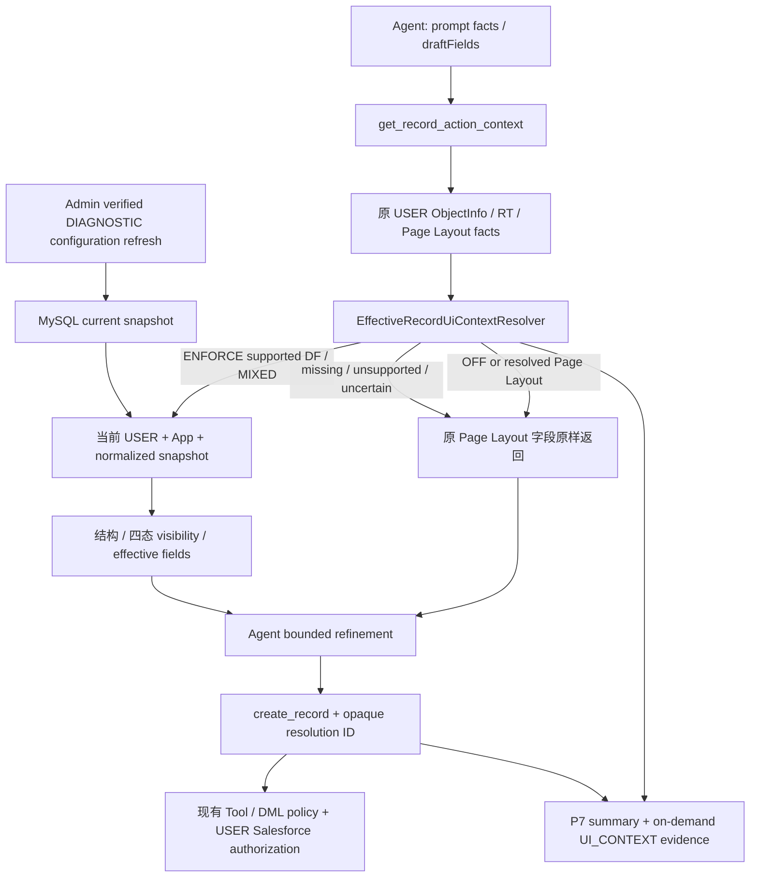

# P8-04 — Effective CREATE UI Context delivery report

Delivery date: 2026-09-07 (Asia/Shanghai). Engineering evidence was collected on
2026-09-06/07. Scope follows P8-04-AMEND-006 and the maintainer's implementation request.

## A. Status

**IMPLEMENTED — READY_FOR_UAT_WITH_LIMITATIONS**

已实现并接通 Runtime、MySQL、Admin、P7 Audit 和 Playbook。未配置对象默认 OFF，
可逐对象 SHADOW / ENFORCE / OFF。生产服务未重启，生产 migration、快照和对象策略未写入，
未执行真实业务 CREATE/UPDATE，未 push。下一阶段由 Maintainer 启动服务并进行真实 UAT。

本报告的回归 PASS 证明所列工程用例通过，不代表真实 Salesforce New UI 或 Agent 准确率。
P8-04 未标记 COMPLETE。最终门槛仍是 Page Layout 100%、Dynamic Forms ≥90%、
RESOLVED ≥95%、Agent 提取/询问/推荐 ≥90%，按独立 UAT 的实际样本计算。

## B. Git

- Branch: `feature/p8-04-effective-ui-context`
- Implementation base: `ac7e31942f5158f5af7ff977b4b8550e121840a4`
- Historical feasibility base: `f60a134715d639b8129af0f3160549d52dec210d`，不作为本轮 diff 基点。

| Commit | 内容 |
| --- | --- |
| `5c31140` | AMEND-006、effective UI contracts、对象策略契约 |
| `f74e0f7` | USER-aware active page、结构解析、四态 visibility、effective fields、fixtures |
| `a97d93a` | 当前快照 repository、migration 012、MySQL / payload 测试 |
| `eb07176` | 请求集成、Admin refresh host、UI Audit、CREATE provenance、HTTP 联动 |
| `cdace07` | Admin UI/API、Playbook 1.6.0、生成产物、浏览器与契约测试 |
| 本报告所在的第六个提交 | UAT、工程报告、测量证据、维护 Skill、回归命令与架构文档 |

第六个提交的完整 SHA 以交付时 `git log --reverse --oneline
ac7e31942f5158f5af7ff977b4b8550e121840a4..HEAD` 为准，避免报告自引用提交哈希。

## C. Baseline Amendments

AMEND-006 将独立 New UI ground truth / Golden Benchmark 从开发前置条件移到
Post-Implementation UAT / Final Acceptance；没有降低验收阈值。允许本轮实现轻量
MySQL current snapshot、Admin refresh、Playbook 和对象级 ENFORCE，默认仍 OFF。
历史 A-01 blocked 记录保留并标注历史语境。[ADR-0019](adr/ADR-0019-effective-create-ui-context.md)
记录新增持久化与解析边界；[项目基线](PROJECT_BASELINE.md)和
[P8-04 基线](P8-04-DYNAMIC-FORMS-BASELINE.md)已同步。

## D. Architecture



复用现有 Context Provider/composition seam、官方 `@salesforce/core` Connection /
Metadata SDK、USER UI API 和 P7 collector。没有新增业务 MCP Tool，也没有修改官方
Tool 实现。共享的只是 org/object 配置快照；USER、draft 和计算结果始终按请求创建。
普通 CREATE context 路径，包括 miss，均不调用 Metadata API。

## E. Page Layout Protection

现有 `RecordActionContextExecutor` 先完成原始 ObjectInfo、RT、defaults、Layout、
picklists 和 field facts；没有把 Page Layout 转成 Dynamic Forms 再计算。
只有 ready CREATE 才进入新增 resolver，UPDATE 沿用原实现。

- OFF 不增加 USER / snapshot / Metadata 读取；返回原字段与一个 opaque ID。
- SHADOW 只增加内部计算和 Audit，原 fields、RT、coverage、defaults 完全保留。
- ENFORCE 确认为 PAGE_LAYOUT 时立即返回原字段；异常或不确定时返回原字段并记录 fallback。
- Context 全部 **42/42 PASS**，其中新增 13 个 P8-04 用例；旧 Page Layout 用例全部通过。
  新增测试对 OFF/SHADOW 和 resolved Page Layout 的字段、默认值、顺序做 deep equality。
- RT 0/1/N、picklist/controller、Lookup 和 managed 字段回归由原 Context、DML、host、
  Playbook 用例覆盖。真实 UI 的 Page Layout 100% 门槛仍等待 UAT，未用 fixture 替代。

## F. Active Page Resolution

1. USER ObjectInfo 决定可用 RT 与字段权限；客户端不能选择 Salesforce username。
2. 当前 USER SOAP identity 提供 org/user/profile；Profile Id 分别映射 Metadata fullName
   和 display Name，前者用于 assignment，后者用于受支持的 USER visibility。
3. App 优先级为请求 `X-Salesforce-App-Developer-Name` → 对象 defaultApp → integration
   default → 当前 USER 可访问 Apps 的收敛结果。显式值也必须经 USER Apps API 验证。
4. AppDefinition Id / DeveloperName / namespace-aware fullName 唯一对应；Profile、RT、
   App、form factor 决定 assignment 优先级：App/Profile/RT → App default → object default
   → standard。冲突、无法确定的 Default 继承或不完整映射不猜测。
5. App 未明确且可用 Apps 指向不同页面，返回 APP_CONTEXT_REQUIRED + Page Layout fallback。
6. 本轮仅支持 Large / desktop standard New。先检查 custom New override；支持范围内
   使用 View Lightning page assignment 的标准 New 行为，入口准确性必须在真实 UI 验证。

Fixture 验证不同 Profile/App 产生不同结果；40 个并发 context 用例验证 draft/USER 隔离。
HTTP 集成进一步验证同一 snapshot：USER A 返回 DF，USER B 返回原 Page Layout。

## G. Dynamic Forms

结构解析跟随 Region / Facet 引用，保留 section、column、order、ancestry 和重复 field
instances，读取 required / readonly。Desktop 忽略 `force:recordDetailPanelMobile`，
实际 desktop Detail + field sections 归为 MIXED，并按支持的 DF sections 计算。
循环、未遍历字段、继承页面、结构越界或无法解释的页面拒绝假装完整解析。

| 项目 | 行为 |
| --- | --- |
| VISIBLE / HIDDEN | 受支持且事实充分的确定结果 |
| PENDING | 缺少受支持的 record draft dependency；返回 dependsOn |
| UNKNOWN | 规则、关系、权限或上下文不在已证明范围内 |
| 比较 | EQUAL/EQ、NE/NOT_EQUAL、GT/GE/LT/LE、CONTAINS、IS_NULL、IS_NOT_NULL/NOT_NULL |
| 组合 | AND / OR / 有界 booleanFilter；最多 150 tokens、25 层 |
| 值语义 | missing、null、false、0、空字符串分别处理；不使用 truthiness |
| USER | Id、ProfileId、Profile.Id、Profile.Name、UserType、LanguageLocaleKey |
| 环境 | 受支持的 form factor operand；无可靠事实则 UNKNOWN |

API required 不因页面隐藏而消失；DF required 只由 VISIBLE instances 生效，PENDING 的
页面 required 用 conditionalRequired 表示。字段须与当前 USER ObjectInfo 交集，
editable 还受 object/field createability、formula、autoNumber 和 readonly 约束。
optionalCandidate 排除 required、HIDDEN/PENDING/UNKNOWN、system、非 editable 和 managed 字段。
重复实例按可见实例聚合，不用隐藏副本覆盖可见副本。

不支持：任意 relationship / formula operand、缺少可信权限事实的 Permission 规则、
未知 operator、依赖未提交记录值的 section/tab/container visibility、完整 Lightning
事件/客户端表达式。它们明确为 UNKNOWN 或页面 fallback，不推导 TRUE/FALSE。
UI_CONTEXT evidence 保留 field/instance 的 ruleResult、criterion kinds、dependencies，
不复制用户 draft 值或完整 FlexiPage。

## H. Snapshot

Migration `012_p8_ui_snapshot.sql` 新增 **1 表、12 列** `sfoa_ui_snapshot`，org/object
唯一、current-only MySQL JSON；原 P7 payload_type ENUM 新增 UI_CONTEXT，不增加旧表列。
保留 normalized assignments、page field instances/rules、App/Profile/RT 配置目录；
没有 raw XML、全量 Metadata payload、业务记录、历史版本、定时 org 同步或 Git runtime cache。

| 边界 | 值 |
| --- | --- |
| 每个 org/object JSON | ≤2 MiB，应用及 DB 约束 |
| 每个 snapshot | ≤100 Apps、500 Profiles、200 RT、100 pages、5000 assignments |
| 每 page | ≤1000 field instances；effective response ≤200 fields / 500 picklist values |
| Runtime 输出 | 复用 524,288-byte 上限，过大 effective output 回退 |
| 策略 | ≤25 个精确对象名，仍受原 runtime setting 4 KiB 上限 |
| Refresh | 手动 Admin；verified 独立 DIAGNOSTIC，120s 等待上限 |
| 重复 refresh | DB lease，180s 后可接管；旧 token 不能提交覆盖 |
| App Metadata reads | 每批最多 10 个，最多两个批次并发 |
| TTL | 24h；过期但合法的旧快照可继续使用，带 SNAPSHOT_STALE |

失败保留旧 JSON/hash/refreshedAt；无合法 snapshot 或 scope/parser 不匹配时回退。
内容 hash 为版本证据；多组件 aggregate `metadata_last_modified` 当前为 null，
不伪造单一 Salesforce 修改时间。Snapshot status/age/hash 会进入 Audit。

只读真实配置 smoke 测量：一个对象 snapshot **29,829 bytes**，24 assignments、21 Apps、
65 Profiles、7 RT、2 pages；DF page 为 **16,508 bytes**（50 fields / 1 rule），PL-only page
为 130 bytes。整个 snapshot 的共享目录和 envelope 约 13,191 bytes。

| 容量估算 | normalized JSON bytes | 约值 |
| --- | ---: | ---: |
| 1 个上述 DF page | 16,508 | 16.12 KiB |
| 100 个同等页面 | 1,650,800 | 1.57 MiB |
| 1000 个同等页面 | 16,508,000 | 15.74 MiB |

这是 page-only 线性估算，不包含每对象共享目录、InnoDB/index/page allocation，
不表示允许 1000 pages 放进一个 row。完整 snapshot 仍受 100 pages / 2 MiB 限制。
MySQL 集成测试验证实际 JSON storage bound。公开数据见
[sanitized engineering evidence](evidence/p8-04-implementation-engineering.json)。

## I. Audit

复用 P7 调用主记录、有序事件、脱敏和 fail-open 写入。Context 产生
UI_CONTEXT_RESOLVED / UI_CONTEXT_RESOLUTION_FAILED，包含 mode、usedForAgent、USER
reference、object/RT、App/form factor、页面、assignment、snapshot/version、coverage、
字段/规则计数和耗时。OFF 不为补齐 Profile 而增加 Salesforce 调用；未知值不伪造。
Page Layout 仅记录可靠 layout id。字段/规则详情进入有界、按需读取的 UI_CONTEXT payload。

完整链路示例（HTTP fixture 的验证关系，以下使用示例别名，并非生产记录）：

```text
Audit CONTEXT-A: get_record_action_context (USER-A / selected RT)
  UI_CONTEXT_RESOLVED: resolutionId = <opaque UUID>
  mode=ENFORCE, formSource=DYNAMIC_FORMS, page=<fixture page>
  assignment=APP_PROFILE_RECORD_TYPE, snapshot=<id/hash/time>
  UI_CONTEXT payload: Name.requiredSource=[DYNAMIC_FORM], field/rule decisions
        ↓ Agent 原样传递该 UUID
Audit CREATE-A: create_record (相同 USER/object/RT)
  UI_CONTEXT_LINK: uiContextResolutionId=<同一 UUID>
  contextLinkStatus=CLIENT_PROVIDED_UNVERIFIED
  原 DML policy → USER Salesforce DML → 原结果/API evidence
```

P7 当前 call/correlation id 不足以确定性跨两次 Tool 调用关联，因此加入 optional opaque
UUID。ID 不含业务值，不授权写入，不触发 Metadata，不作为自动归属证明；未传则
NOT_PROVIDED，DML 继续。HTTP 测试确认最终 Salesforce payload 没有 provenance 字段，
且 UI payload 不含输入的 PRIVATE_DRAFT。MySQL 测试验证同一 P7 sink 的事件与 payload 绑定。

定位方式：`yarn ai:audit --trace <publicAuditId>`，再用
`yarn ai:audit --ui-context <UUID> --since 24h --latest 20` 找到来源与 CREATE；核对
USER/object/RT/时间顺序后再归因。该参数使用有界、参数化 read-only SQL；真实数据库
无匹配 UUID 的负向探针返回稳定 NOT_FOUND。保留期结束或 payload 截断属于证据缺口。

## J. Admin UI/API

Admin 新增“CREATE 页面上下文”：对象 OFF/SHADOW/ENFORCE、对象 defaultApp、integration
default App、手动 refresh、page/source、App/Profile/RT 范围、状态、时间、parser 和错误。
复用已有 runtime settings optimistic rowVersion，禁止 wildcard / 重复对象 / 全局 ENFORCE。

- GET `/admin/api/ui-context/snapshots`：最多 100 个 summary，不返回 raw Metadata。
- POST `/admin/api/ui-context/:objectApiName/refresh`：严格空对象 body，复用 Admin
  session、Origin、CSRF 与 verified 独立 DIAGNOSTIC 检查。
- Audit Workbench 新增“页面上下文”和折叠“字段依据”；默认不请求 payload body。
- 1440px desktop / 390px mobile 浏览器用例通过，验证保存 ENFORCE、refresh、局部表格滚动。
  页面使用 mock API；真实 refresh collector 另以只读配置 smoke 验证。

## K. Agent Playbook

Canonical Playbook **1.6.0** 已同步五个 Dify / WorkBuddy / Skill 产物，MCP 原生
Instructions、Resources、Prompt、Tool fallback 继续统一由 canonical 生成。
Agent 提取原 prompt 已给出的事实为 draftFields，处理 VISIBLE / HIDDEN / PENDING /
UNKNOWN、先补 dependency、最多三次 refinement、从 optionalCandidate 中选约 3–8 项
相关候选，并将最新 resolution ID 传给 CREATE。无需模型理解 Metadata 或 booleanFilter。

managed-platform-user-lookup-fallback 仍是独立规则：显式值优先；必填且缺失询问一次
并允许默认选择；可选且缺失省略；UPDATE 只写请求字段。新 effectiveRequired/Editability
存在时使用它们，否则保留 legacy apiRequired/layoutRequired 语义。Prompt 不替代权限。

## L. Performance

100 次/场景的本地 synthetic resolver 测量，含模拟 Page Layout 路径，**不包含真实网络、
JWT、MySQL 等待或 Agent 时间**。表中 API 数是每次 context 相对于旧路径的新增调用。

| 场景 | median ms | p95 ms | 新增 USER API | snapshot reads | Metadata API |
| --- | ---: | ---: | ---: | ---: | ---: |
| OFF | 0.251 | 1.606 | 0 | 0 | 0 |
| ENFORCE → Page Layout | 0.382 | 1.504 | 2 | 1 | 0 |
| DF cache hit | 0.648 | 4.170 | 2 | 1 | 0 |
| DF cache miss | 0.222 | 0.901 | 1 | 1 | 0 |

新增 USER identity、snapshot、Apps read 各有 3s 等待界限；这不是整个 Tool 的 3s SLA，
也不保证取消底层在途请求。Snapshot miss 不自动 refresh；stale hit 无 Metadata 调用。

真实只读配置 refresh collector 完成于 **58,034 ms**：11 次 API = 1 SOAP + 3 REST
configuration queries + 7 Metadata（Object 1、App directory 1、Profile directory 1、
App reads 3、referenced pages 1）。真实 Admin 路径另外先读一次 SOAP org identity
取得 lease scope，因此相同配置预计为 12 次；未把 collector 数误报为 Admin 端到端次数。
先前串行 App reads 探针超过 150s；改为有界两批并发后上述探针通过，生产仍使用 120s
上限并允许失败后手动重试。此耗时证明 Metadata 适合离线 refresh，不适合逐次 CREATE。

## M. Regression

| 边界 | 已验证内容 |
| --- | --- |
| Identity | USER/DIAGNOSTIC role、request scope、并发隔离，身份包 71 PASS |
| DML | 原 policy/default-deny、CRUD/FLS 错误、outcome unknown、无 Metadata 再解析 |
| Lookup fallback | 显式值（含 null/空值）保留、可选省略、必填 Playbook、CREATE-only、最小 UPDATE |
| Audit | 原 fail-open/redaction/payload bounds，新增 UI event/payload、missing ID、HTTP→CREATE link |
| P7-09 | 原 lazy Connection / request memoization；协议和本地能力不因 UI 配置创建 Connection |
| Tool Governance | 现有 enabled/allowlist/role 门槛；UI policy 不启用 Tool 或 DML |
| Upstream | contract compatibility PASS，官方源文件与 lockfile 无变更 |

## N. Tests

本轮采用仓库已有测试与新增有效行为测试。Windows Yarn 嵌套启动偶发 Access is denied，
回归 runner 使用相同 workspace 的 Node/TypeScript/test 可执行文件直接调用。
Host 保持 Node 测试进程隔离，避免 SIGTERM fixture 终止其他套件。

| Gate | 结果 | 证据/范围 |
| --- | --- | --- |
| 8 个受影响 workspace build / lint | PASS | identity、CP、context、DML、Playbook、host、API、Web；Web 最后样式修正后 tsc 再通过 |
| Identity unit | PASS 71 | 原身份/连接/Audit 边界 |
| Control Plane unit / MySQL | PASS 38 / 13 | migration、lease、current snapshot、JSON bound、UI payload sink |
| Context | PASS 42 | 包含 13 个新增 DF/PL/visibility/assignment/draft/concurrency 用例 |
| DML | PASS 22 | optional provenance 不进入 Salesforce payload |
| Playbook | PASS 19 | contract、bounded refinement、fallback、generated drift |
| Host unit | PASS 125 | 原 host 回归及 managed effective facts |
| P3 / P4 / P5 / P7 | PASS 23 / 8 / 5 / 6 | 包含新增 HTTP USER A/B→CREATE Audit 测试 |
| Admin API | PASS 25 | session / CSRF / strict body / policy / refresh |
| Admin Web | PASS 65（分次） | 全套 64 PASS + 新测试按钮空格选择器修正后单测 1 PASS；未冒充单次 65 PASS |
| Focused browser | PASS 1 | desktop/mobile mock Admin 保存与刷新 |
| Agent sync / check | PASS | 五个 deterministic artifacts |
| Skill sync / check / delivery | PASS | canonical 与三平台 copies / trackability |
| Skill test（已构建工作区） | PASS 12 | 直接 Node 命令 |
| Clean-checkout Skill smoke | FAIL — PRE-EXISTING | 下述旧 doctor fixture 缺陷，不修改无关历史测试 |
| Upstream compatibility | PASS | drift=[] |
| Original stdio | PASS | initialize / tools/list（5 Tools）/ get_username，响应内容不输出 |
| Read-only Salesforce configuration | PASS | 上述 29,829-byte snapshot；无生产 snapshot 写入，无业务 DML |
| Real New UI / 小犇 / WorkBuddy accuracy | NOT RUN | 按授权由 Maintainer 下一阶段执行 |
| Live CREATE / UPDATE / deployment | NOT RUN | 未要求本轮执行 |

已通过用例合计 **475**（包含 12 Skill + 1 browser，Web 按修正后分次结果合计；不重复计入
HTTP 单测重跑或 synthetic iterations）。其余 command checks 与 read-only smoke 单独记录。

Clean-checkout 已知缺陷：未构建 Playbook 时 doctor 返回 orgObjectUsage=SKIPPED，旧
`toolkit.test.mjs` 仍断言 `Array.isArray(report.orgObjectUsage.problems)`。A-01 已在
`8279d21` 基线复现；本轮工作区因包已构建而 12/12 通过。最终从 committed HEAD 的
archive 再执行 smoke：Skill test 为 11 PASS / 1 FAIL，失败项仅此一项；validate、sync、
check、ai:snapshot、missing-env doctor 全部通过。结果已归档，不声明该 gate PASS。

重跑入口：`node scripts/p8-04-regression.mjs`（可传 workspace directory name 缩小范围）；
browser：在 `packages/sfoa-admin-web` 执行
`node node_modules/@playwright/test/cli.js test e2e/p8-effective-ui.spec.ts`；
只读 collector：`node scripts/p8-04-readonly-smoke.mjs --object <ObjectApiName>`。
开发原始日志位于忽略的 `.temp/p8-04-regression/`；公开摘要在本报告与 sanitized evidence，
不把本地日志或 Git evidence 当生产配置源。

## O. Known Limitations

- Large / desktop standard New 范围；Custom New Override、Small/Medium、继承/未知页面结构
  回退。Record-dependent container/tab visibility 和任意关系/不可靠 Permission 为 UNKNOWN。
- Profile/App/RT metadata 映射须完整且唯一。没有实际请求 App 时仅接受可用 Apps 收敛；
  不猜最近使用的 Lightning App。integration default 复用部署级配置，不引入多租户模型。
- View assignment 对实际 standard New 的作用、MIXED、默认值驱动 visibility 需要真实 UAT
  对照。Schema 接受的合法配置不等于 Salesforce UI 行为已被独立证明。
- Snapshot 手动更新，24h 后合法旧值可继续用并告警；Metadata 延迟或权限限制会让 refresh
  失败，底层调用可能晚于等待上限结束，结果受 abort/lease 保护。
- Refinement 是 input 0..3 + Playbook 的无状态约束，没有服务器跨调用会话计数器。
- Provenance UUID 是 client-provided unverified；Audit 保留期/截断可能使历史闭环缺证。
  不用 UUID 成功匹配代替 USER/object/RT/时间核对。
- Dynamic Forms UPDATE 未启用；READ 无新增行为；不模拟 Validation、Flow、Trigger、LWC。
- metadata_last_modified 保留 null；有 hash / refreshedAt；未建设 Metadata history。
- Skill clean-checkout smoke 有上述 PRE-EXISTING fixture 失败；生产代码回归没有未解决失败。

## P. Complexity

| 项目 | 本轮增量 |
| --- | --- |
| 新表 / 新列 | 1 表、12 列；旧表 0 新列，1 ENUM 扩展 |
| 新依赖 / lockfile | 0 / 无变化 |
| 新业务 MCP Tool | 0 |
| Production TypeScript / TSX diff | +1,137 / −25 = net +1,112 lines，40 个源码文件 |
| Migration SQL | +19 lines；合并生产改动 net +1,131 |
| normalized Metadata 样本 | DF page 16,508 bytes；整个对象 snapshot 29,829 bytes |
| Runtime Metadata calls | 0，包括 miss / stale |

LOC 以 implementation base 的 `git diff --numstat -- packages` 统计 `src/`，排除
test / p3-test / p4-test / p5-test / p7-test / mysql-test，另列 migration；包含 contracts、
Admin UI、Playbook 源码，不把文档、fixtures、生成 Skill、测试 harness 混入生产 LOC。
只有一个 focused resolver、parser/evaluator、snapshot repository 与 refresh seam；没有
第二个权限/审计框架、规则服务、缓存平台、调度器或 Metadata 浏览/编辑平台。

## Deviations from Prompt

| 原建议 | 本轮设计 | 原因 |
| --- | --- | --- |
| 多个可选的 Context Provider / Resolver 类 | 保留原 executor + 一个 effective resolver，结构/visibility 为纯函数 | 复用原 Page Layout，避免仅为层次新增适配器 |
| 优先使用现有 run/session 跨调用关联 | optional uiContextResolutionId + 原 P7 events | 现有 correlation 是调用级，不足以可靠关联 Context→CREATE |
| 可采用 snapshot 自动刷新或服务 | 仅 Admin 手动 refresh，miss 不刷新 | 实测 Metadata 数十秒，避免拖慢 CREATE 与构建后台同步平台 |
| metadata lastModified | aggregate 留 null，hash + refreshedAt | 多组件无单一可靠 lastModified，避免伪造时间 |
| 完整 visibility / container 推导 | 只对已支持事实确定求值，其余 UNKNOWN/fallback | 不把 unsaved field visibility 规则错误套用到 section/tab 初始加载 |
| 按普通 Yarn 命令执行全部回归 | Windows 故障时直接调用同一 workspace executable | 保持测试内容，排除嵌套启动器与 SIGTERM 隔离问题 |

下一步仅按 [UAT checklist](P8-04-UAT.md) 由 Maintainer 选对象、启动服务、采集真实 Agent
和 New UI 对照，并依据 P7 证据决定 HOTFIX、保持 SHADOW/OFF 或 FINAL ACCEPTANCE。
